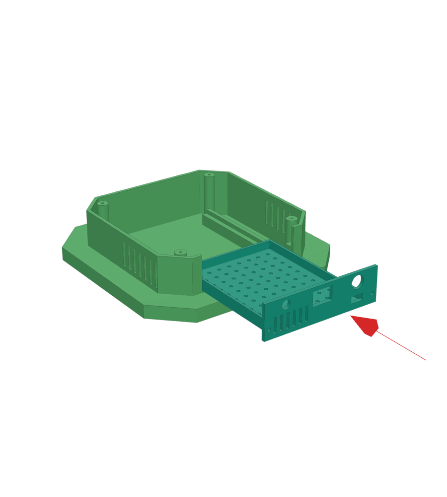
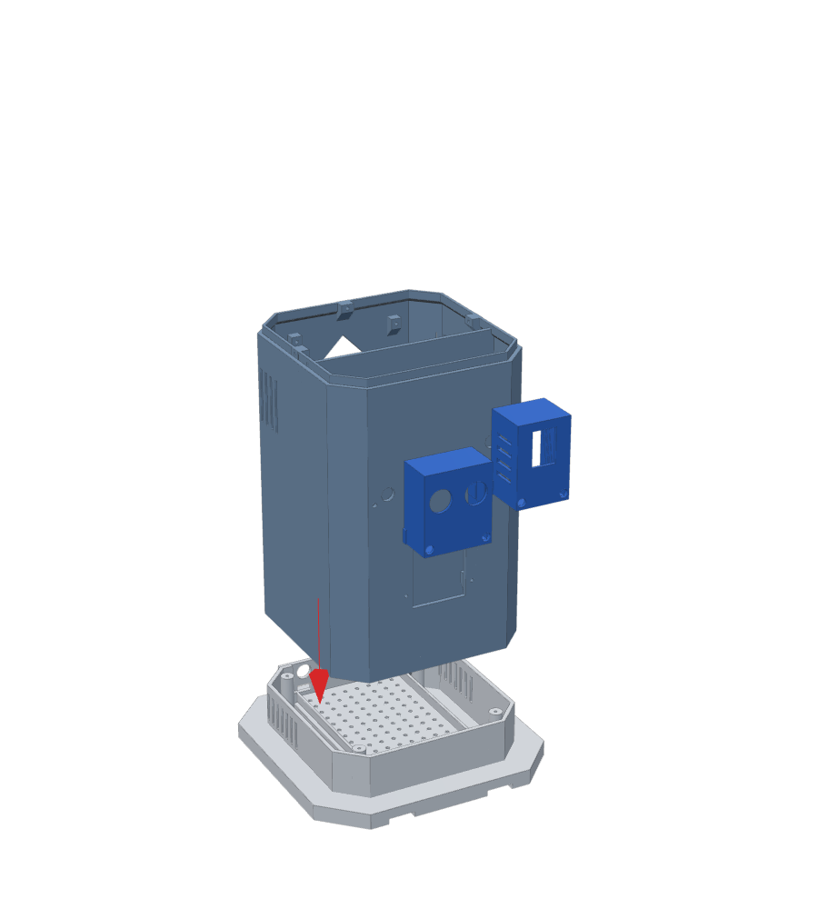
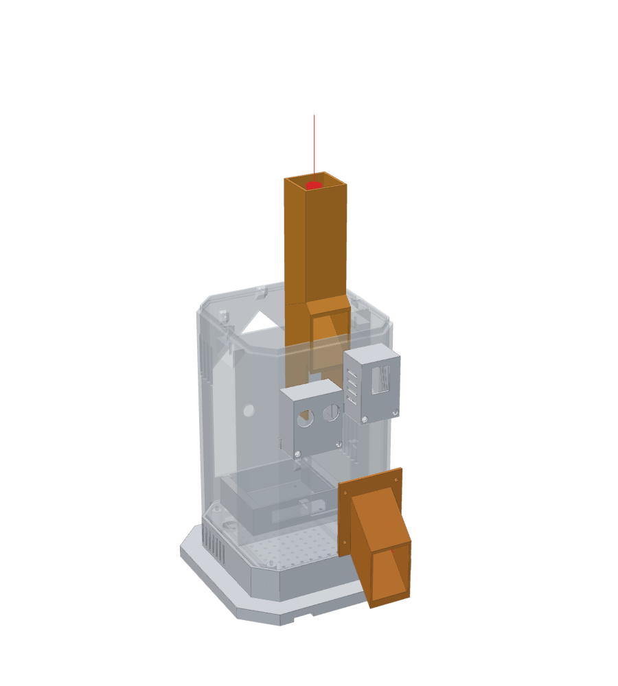
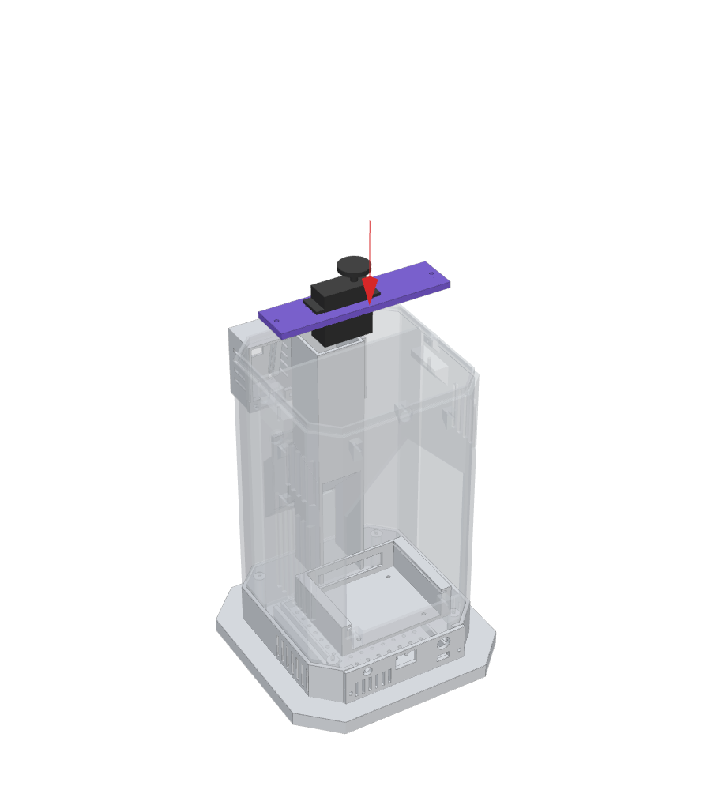
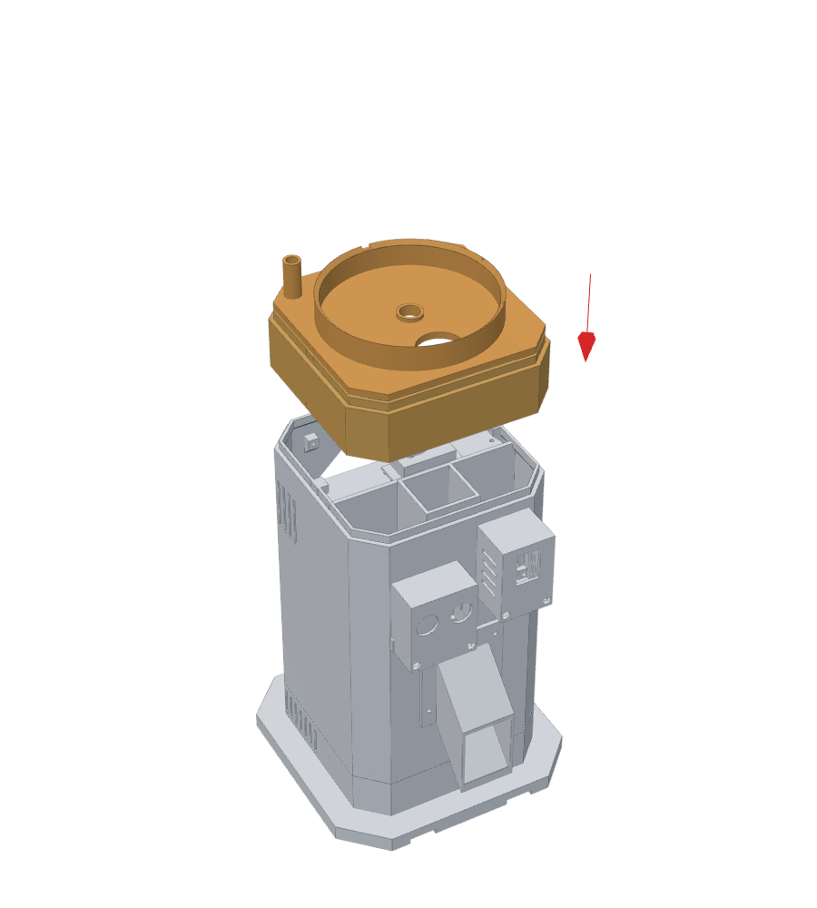
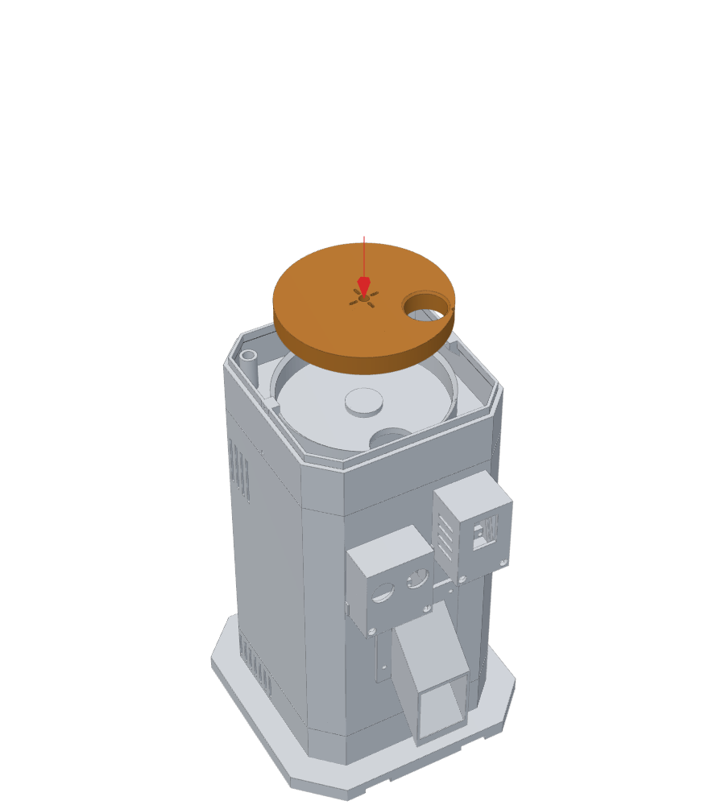
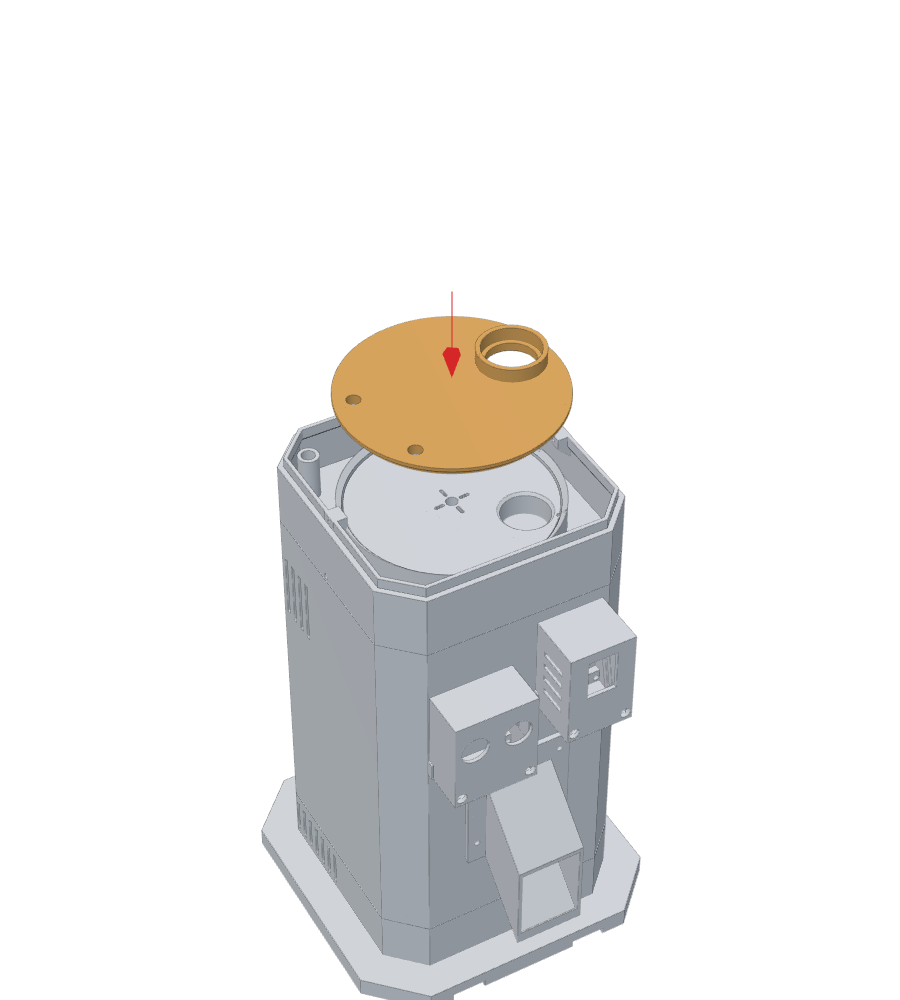
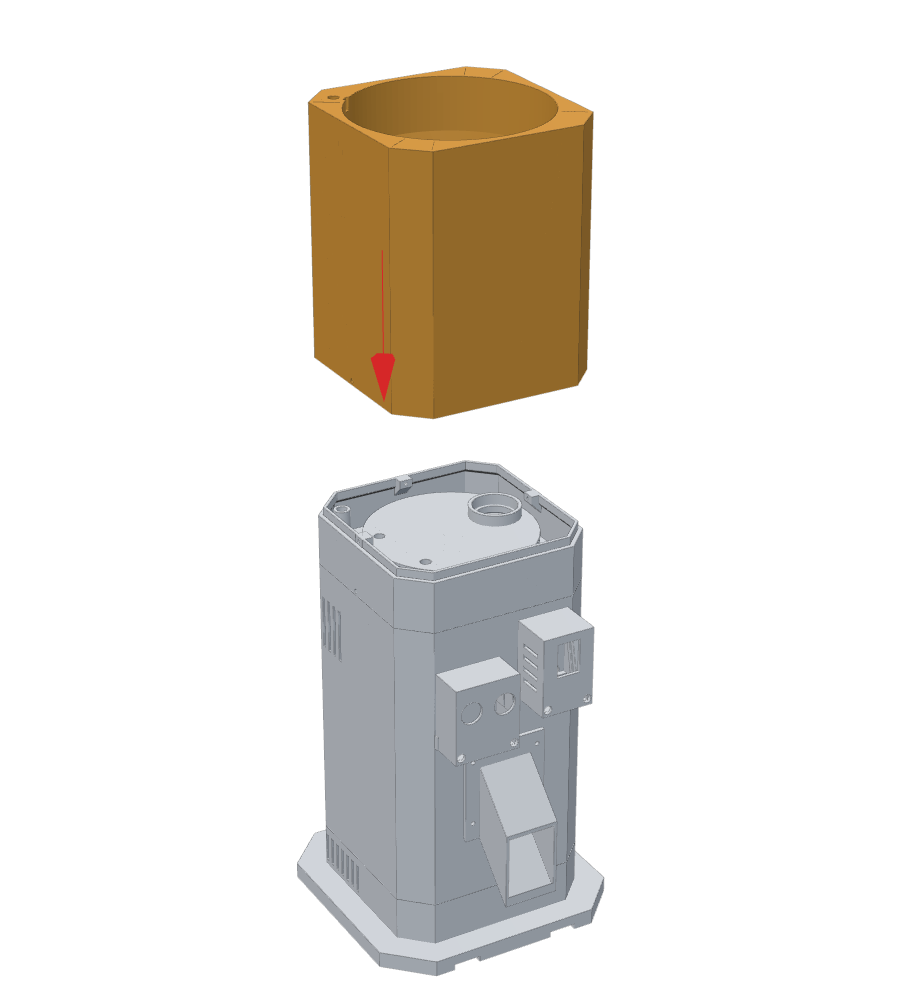
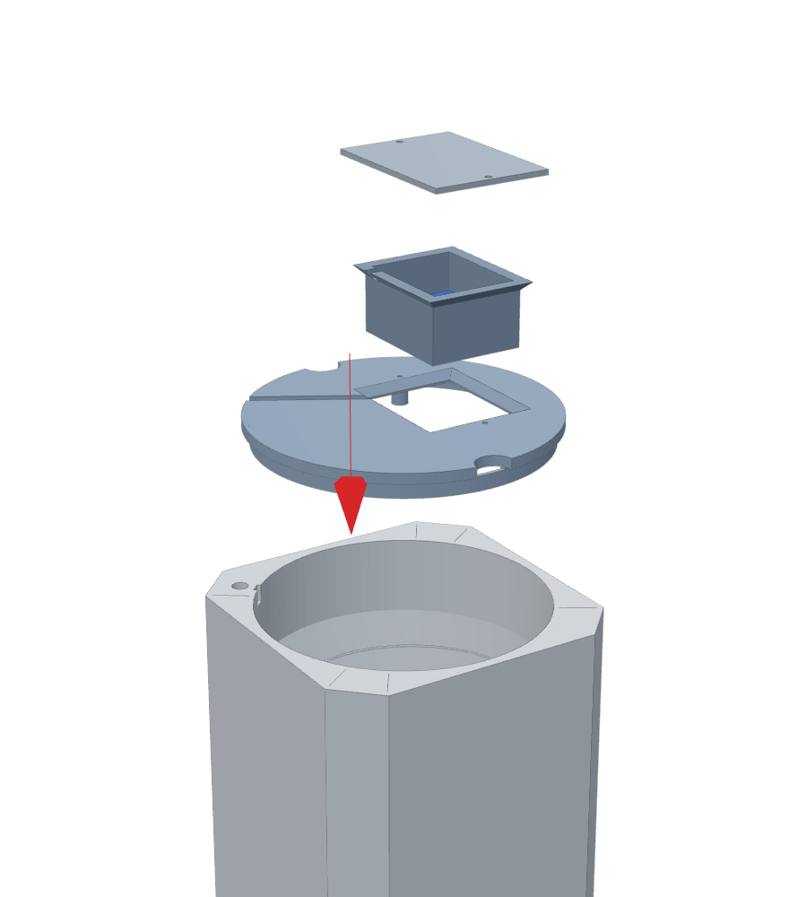
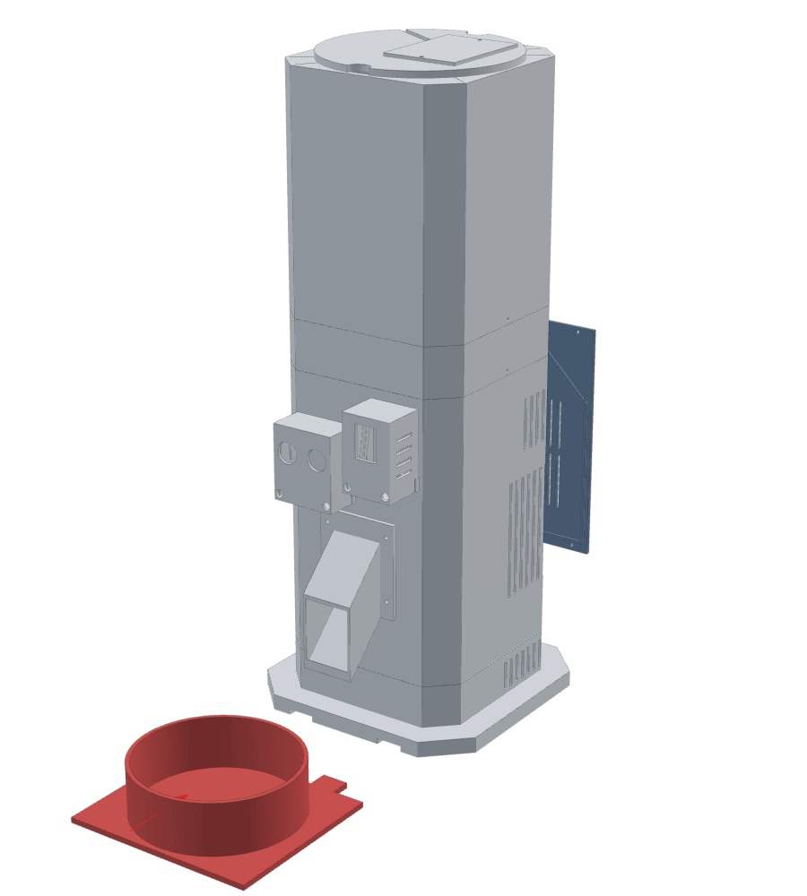

# Manual de armado · Dispensador inteligente de alimento para mascotas

**Torre modular impresa en 3D + estación solar remota + sensor de nivel en la tolva**

Este manual explica cómo pasar de las piezas impresas a la torre armada, paso por paso. Las piezas se imprimen
con los STL de [`Mechanical/STL`](../../Mechanical/STL) (ya orientados para la **Elegoo Neptune 4 Plus**) siguiendo el
[plan de impresión](../../Mechanical/plan_impresion.md). El cableado eléctrico está en la
[tabla de conexiones](../wiring/tabla_conexiones.md), el [esquema completo](../wiring/esquema_conexiones.svg) y la
[placa de control](../wiring/placa_control.md); aquí se indica **en qué momento** del armado conviene hacer cada parte.

> **Antes de empezar:** lea el manual completo una vez. Hay dos pasos que no se pueden hacer después sin desarmar:
> la bandeja del ESP32 y las cápsulas del frente se atornillan **antes** de unir el cuerpo a la base (paso 2), y el
> disco se calibra **antes** de colocar la placa superior (pasos 6 y 7).

---

## Índice

0. [Herramientas y tornillería](#0-herramientas-y-tornillería)
1. [Control de las piezas impresas](#1-control-de-las-piezas-impresas)
2. Pasos de armado
   [1 Base y cajón](#paso-1--base-01-y-cajón-de-energía-16) ·
   [2 Cuerpo](#paso-2--cuerpo-02-bandeja-05-y-cápsulas-03-04) ·
   [3 Conducto y pico](#paso-3--conducto-09-y-pico-10) ·
   [4 Servo](#paso-4--servo-mg995-y-viga-06) ·
   [5 Dosificador](#paso-5--carcasa-08a-y-placa-base-08d) ·
   [6 Disco](#paso-6--disco-dosificador-08b-y-calibración) ·
   [7 Placa superior](#paso-7--placa-superior-08c) ·
   [8 Tolva](#paso-8--tolva-07) ·
   [9 Tapa y sensor de nivel](#paso-9--tapa-13a-con-el-sensor-de-nivel-13b--13c) ·
   [10 Tapa trasera y comedero](#paso-10--tapa-de-servicio-14-y-comedero-11) ·
   [11 Estación solar](#paso-11--estación-solar-remota-12a--12b)
3. [Calibración del sensor de nivel](#3-calibración-del-sensor-de-nivel)
4. [Pruebas finales](#4-pruebas-finales)
5. [Uso diario, limpieza y desarme](#5-uso-diario-limpieza-y-desarme)
6. [Problemas frecuentes](#6-problemas-frecuentes)

---

## 0. Herramientas y tornillería

**Herramientas:** destornillador Phillips PH1 y PH2, llave o pinza para tuercas M3 (5,5 mm) y M4 (7 mm),
calibre (pie de rey), multímetro, cautín y estaño, termorretráctil, pistola de silicona caliente (o silicona neutra),
cúter o desbarbador, broca de 3,4 mm y de 2,5 mm (solo para repasar agujeros), cinta doble faz de espuma (VHB).

**Tornillería (total del proyecto):**

| Elemento | Cantidad | Dónde |
|---|---|---|
| Tornillo M3 × 10 (cabeza Phillips) | 26 (+4 de repuesto) | uniones de módulos, cápsulas, bandeja, viga, pico, tapa de servicio, cajón |
| Tornillo M3 × 12 | 6 | base ↔ cuerpo (4) y tapa de la cápsula del sensor de nivel (2) |
| Tuerca M3 | 8 (+4) | cápsulas 03/04 y bandeja 05 |
| Tornillo M4 × 12 (mejor cabeza moleteada o mariposa) | 2 | pivote de la estación solar |
| Tuerca M4 + arandela M4 | 2 + 2 | pivote de la estación solar |
| Tornillos del servo, horn redondo y su tornillo central | los que trae el MG995 | servo ↔ viga, horn ↔ disco |
| Bridas plásticas (precintos) 2,5 mm | 6 | cables |
| Tornillos para madera Ø4 o tacos (opcional) | 4 | fijar la estación solar al suelo o a un muro |

**Reglas para los tornillos en plástico:** los agujeros de Ø2,5 mm están hechos para que el tornillo M3 haga su propia
rosca. Atornille despacio, sin taladro, y pare en cuanto la cabeza apoye: si se pasa, la rosca se barre. Los agujeros
pasantes (Ø3,4 mm) deben dejar pasar el tornillo sin esfuerzo; si no, repáselos con la broca de 3,4 mm a mano.

---

## 1. Control de las piezas impresas

| Código | Pieza | Material | Control después de imprimir |
|---|---|---|---|
| 01 | Base de la torre | PLA | quitar la falda; los 4 pilares de las esquinas deben estar enteros |
| 02 | Cuerpo principal | PLA | probar que 08a entra en el labio superior sin forzar (holgura 0,3 mm) |
| 03 / 04 | Cápsulas HC-SR04 / ESP32-CAM | PLA | presentar el sensor y la cámara: deben entrar sin limar |
| 05 | Bandeja del ESP32 | PLA | la placa perforada de 90 × 70 mm desliza en las guías |
| 06 | Viga del servo | PETG | el MG995 entra en su ventana; orejas sobre las ranuras |
| 07 | Tolva | PETG | pasar el dedo por dentro del embudo: sin hilos ni gotas (el alimento debe deslizar). Ver el surco **MAX** |
| 08a | Carcasa del dosificador | PLA | — |
| 08b | Disco dosificador | PETG | cara inferior plana: apoyarlo en una mesa y comprobar que no se balancea |
| 08c / 08d | Placas superior y base | PETG | superficies de deslizamiento lisas; quitar rebabas de los agujeros de entrada y salida |
| 09 / 10 | Conducto y pico | PETG | mirar a contraluz: el interior debe estar libre |
| 11 | Comedero | PETG | — |
| 12a / 12b | Estación solar (base y bandeja) | PETG | la tuerca M4 entra en el hexágono de cada nudillo de 12b |
| 13a / 13b / 13c | Tapa, cápsula del sensor de nivel y su tapa | PETG | la cápsula 13b asienta en el avellanado de 13a quedando al ras |
| 14 | Tapa de servicio | PLA | — |
| 15 | Separadores | PLA | 12 tubos de 3, 6 y 10 mm |
| 16 | Cajón de energía | PETG | el interruptor encaja en su ventana de 19,2 × 13 mm |

> Si alguna pieza que encaja en otra queda justa, **lije la pieza interior** (el labio o la pestaña), no la exterior.

---

## 2. Pasos de armado

### Paso 1 · Base (01) y cajón de energía (16)

**Piezas:** 01, 16, separadores 15 · **Tornillería:** 2 × M3×10 + los de cada módulo electrónico ·
**Antes:** módulos de energía ajustados (Buck A = 6,0 V, Buck B = 5,0 V, MT3608 = 5,0 V, con multímetro y sin carga).

1. Coloque en la tapa trasera del cajón: el **interruptor S1** (entra a presión en la ventana rectangular del centro),
   el **conector GX12 hembra** del panel (agujero redondo de 12 mm que está **encima** de la ventana pequeña del USB-C;
   el cuerpo por fuera y la tuerca por dentro) y el portafusible F1 o un LED en el agujero de Ø8 del otro lado. El USB-C
   del cargador debe quedar frente a su ventana pequeña.
2. Fije los módulos al piso del cajón usando la rejilla de agujeros (paso 10 mm) con tornillos M3 y separadores 15:
   portapilas 2S, BMS, cargador 2S, MT3608, Buck A, Buck B y la placa de los divisores. Los módulos sin agujeros se pegan
   con cinta doble faz de espuma.
3. Cablee el cajón según la [tabla de conexiones, sección 3](../wiring/tabla_conexiones.md#3-cajón-de-energía-pieza-16).
   Deje salir hacia arriba: el cable J1 (5 V), el cable de la ESP32-CAM (5 V), el cable J4 (mediciones) y el cable de
   potencia del servo (6 V).
4. Con S1 apagado y **sin** las celdas, revise con el multímetro que no haya continuidad entre + y − de cada salida.
   Coloque las celdas, encienda S1 y mida: VBAT 6,0–8,4 V, 6,0 V y 5,0 V. Apague S1.
5. Deslice el cajón en la base **desde atrás** hasta que la tapa trasera apoye, y atorníllelo con 2 × M3×10 en los
   agujeros de la tapa trasera.

✔ **Comprobación:** el cajón entra y sale sin tocar los cables; el interruptor y el GX12 quedan accesibles por detrás.

### Paso 2 · Cuerpo (02), bandeja (05) y cápsulas (03, 04)

**Piezas:** 02, 03, 04, 05 · **Tornillería:** 8 × M3×10 + 8 tuercas M3; 4 × M3×12 para unir con la base.

1. **Bandeja del ESP32 (05):** apóyela en el piso de la bahía trasera de 02 (detrás del tabique) y atorníllela con
   4 × M3×10; las tuercas van por **debajo** del piso. Hágalo ahora: después la base tapa el acceso.
2. **Cápsula 03 (HC-SR04 de presencia, frente izquierda):** coloque el sensor con los pines hacia abajo, pase el cable de
   4 hilos por el agujero del frente y fije la cápsula con 2 × M3×10 + tuercas por dentro de la pared.
3. **Cápsula 04 (ESP32-CAM, frente derecha):** coloque la cámara (lente hacia el frente, con 470 µF + 100 nF ya soldados
   a sus pines de 5 V/GND), pase el cable de 5 V por su agujero y fíjela con 2 × M3×10 + tuercas.
4. Lleve los cables de 03 y 04 a la bahía trasera por los pasos izquierdo y derecho del tabique. **Ningún cable cruza el
   canal de alimento.**
5. Pase los cables que suben del cajón (J1, J4, cámara, 6 V del servo) por el agujero del piso de 02.
6. Apoye 02 sobre la base 01 y atorníllelo con 4 × M3×12 **desde arriba**, a través del piso, a los pilares de 01.

✔ **Comprobación:** la torre no cabecea; los cables no quedan pellizcados entre 01 y 02.

### Paso 3 · Conducto (09) y pico (10)

**Piezas:** 09, 10 · **Tornillería:** 4 × M3×10.

1. Baje el conducto 09 **desde arriba** por la zona frontal de 02 (delante del tabique), con el codo hacia el frente,
   hasta que apoye en el piso. Su boca superior queda centrada bajo la futura salida del disco.
2. Coloque el pico 10 desde fuera, encajado en la abertura del frente, y atornille su brida con 4 × M3×10.

✔ **Comprobación:** deje caer una croqueta por la boca superior de 09: debe salir por el pico sin trabarse.

### Paso 4 · Servo MG995 y viga (06)

**Piezas:** 06, MG995, separadores de 3 mm · **Tornillería:** 2 × M3×10 + los 4 tornillos del servo.

1. **Centre el servo antes de montarlo:** en la mesa de trabajo, conéctelo a J3 de la placa de control y al 6 V del
   Buck A, cargue el firmware y envíe por el monitor serie `SERVO 1500` (ver [`ESP32/README.md`](../../ESP32/README.md)).
   No gire el eje a mano después.
2. Atornille el MG995 a la viga 06 con sus 4 tornillos (las ranuras permiten ajustar).
3. Apoye la viga en las dos ménsulas internas de 02 y atorníllela con 2 × M3×10. Si el eje queda bajo, ponga
   separadores de 3 mm (15) como calces.
4. Lleve el cable del servo a la bahía trasera: naranja → J3 SIG, marrón → J3 GND **y** GND del Buck A, rojo → 6 V del
   Buck A (con el condensador de 1000–2200 µF junto al servo).

✔ **Comprobación:** la estría del servo queda en el centro de la torre, apuntando hacia arriba.

### Paso 5 · Carcasa (08a) y placa base (08d)

**Piezas:** 08a, 08d · **Tornillería:** 3 × M3×10 (radiales).

1. Coloque la carcasa 08a sobre el labio de 02 y fíjela con 3 × M3×10 desde fuera, en el centro de las paredes
   izquierda, derecha y trasera (los tornillos roscan en los tetones del labio).
2. Baje la placa base 08d dentro de 08a hasta que apoye en el labio de 02, con el **agujero de salida (Ø32) hacia el
   frente** y el tubito del conducto de cables en la **esquina trasera izquierda**.

✔ **Comprobación:** la estría del servo asoma por el agujero central de 08d; la salida de 08d queda sobre el conducto 09.

### Paso 6 · Disco dosificador (08b) y calibración

**Piezas:** 08b, horn redondo del MG995 · **Tornillería:** tornillos del horn y tornillo central del servo.

1. Atornille el horn redondo al disco 08b (cara inferior) con los tornillitos que trae el servo.
2. Con el servo en 1500 µs, apoye el disco con su marca frente a la marca **CERRADO** de 08d y encájelo en la estría.
   Coloque el tornillo central.
3. Gírelo con `SERVO <µs>` y compruebe que no roce en ningún punto (debe quedar ~0,5 mm de luz bajo el disco).
4. **Calibre ahora** las posiciones ENTRADA, CERRADO y SALIDA con las marcas de 08d a la vista
   ([`Documentation/calibration`](../calibration)) y anótelas en `config.h`.

✔ **Comprobación:** `CICLO 1` mueve el disco ENTRADA → SALIDA → CERRADO sin golpes ni roces.

### Paso 7 · Placa superior (08c)

**Piezas:** 08c · **Sin tornillos.**

1. Baje la placa superior 08c sobre el asiento cónico de 08d con la **chaveta** en su chavetero (solo entra en una
   posición). El zócalo (anillo saliente) queda sobre la entrada, a la derecha mirando la torre de frente.

✔ **Comprobación:** `CICLO 1` sigue funcionando igual (si roza, la placa no asentó: levántela y vuelva a bajarla).

### Paso 8 · Tolva (07)

**Piezas:** 07 · **Tornillería:** 3 × M3×10 (radiales).

1. Baje la tolva sobre el labio de 08a: la **boca inferior del embudo entra en el zócalo de 08c** y el tubo de cables de
   la esquina trasera izquierda queda alineado con el de 08d.
2. Fíjela con 3 × M3×10 en el centro de las paredes izquierda, derecha y trasera.

✔ **Comprobación:** mire desde arriba: la boca del embudo coincide con la entrada de 08c; por el tubo de la esquina se
ve la bahía trasera.

### Paso 9 · Tapa (13a) con el sensor de nivel (13b + 13c)

*Recomendación del profesor: un segundo HC-SR04 dentro de la tolva avisa cuando la comida se está acabando.*

**Piezas:** 13a, 13b, 13c, HC-SR04 n.º 2 · **Tornillería:** 2 × M3×12 · cable de 4 hilos de ~120 cm.

1. **Cable:** suelde (o conecte con un conector Dupont de 4 vías) el cable al HC-SR04 n.º 2 en el orden VCC-TRIG-ECHO-GND
   y aísle con termorretráctil.
2. **Sensor en la cápsula 13b:** apoye la placa con los **dos transductores hacia abajo**, pasándolos por los agujeros
   del piso de la cápsula; la placa descansa en los dos nervios. Los transductores quedan aproximadamente al ras de la
   cara inferior (si sobresalen un poco, no importa; si quedan hundidos, lime un poco los nervios).
   Fije la placa con dos gotas de silicona en los nervios (no tape los transductores). Saque el cable por la **muesca**
   del borde de la cápsula.
3. **Cápsula en la tapa:** desde arriba, introduzca la cápsula en la abertura de la tapa 13a: el ala a 45° asienta en el
   avellanado y queda al ras de la cara superior. Acomode el cable en la **ranura** que va hacia la llave de la tapa.
4. Coloque la tapa de la cápsula 13c y atorníllela con 2 × M3×12 a los tetones de 13a. El cable queda apretado en la
   muesca: no se tironea de las soldaduras.
5. **Recorrido del cable:** desde el borde de la tapa, el cable baja por el **tubo de la esquina trasera izquierda**
   (tolva 07 → placa base 08d) hasta la bahía trasera de 02, y llega a **J5** de la placa de control
   (GND-ECHO-TRIG-VCC de izquierda a derecha en el borde superior de la placa; el mismo cable, girado).
   Deje **~20 cm flojos** entre la tapa y el tubo: así la tapa se levanta y se apoya al costado para cargar alimento.
6. Coloque la tapa: la **llave** del aro inferior entra en la ranura de la tolva (esquina trasera izquierda). Solo hay
   una posición, y siempre es la misma: así la calibración del sensor no cambia al abrir y cerrar.

✔ **Comprobación:** con la tolva vacía, el comando serie `NIVEL` responde una distancia (no "sin lectura").

⚠ **Nunca llene por encima del surco MAX** del embudo: el HC-SR04 no mide a menos de 2 cm, y el surco está a 3 cm
de los transductores.

### Paso 10 · Tapa de servicio (14) y comedero (11)

**Piezas:** 14, 11 · **Tornillería:** 4 × M3×10.

1. Coloque la placa de control (con el ESP32) en la bandeja 05 deslizándola por las guías y conecte J1 a J5.
2. Cierre la bahía trasera con la tapa de servicio 14 (4 × M3×10). Las ranuras quedan como ventilación.
3. Encaje el comedero 11 por delante: sus dos lengüetas entran **bajo el plinto** de la base. Sin tornillos.

✔ **Comprobación:** el pico deja caer el alimento dentro del cuenco del comedero.

### Paso 11 · Estación solar remota (12a + 12b)

*Recomendación del profesor: el panel solar puede ir aparte del sistema, alejado del dispensador.*

**Piezas:** 12a, 12b, panel solar · **Tornillería:** 2 × M4×12, 2 tuercas M4, 2 arandelas M4, 1 brida, 4 tornillos
para madera o tacos (opcional) · cable bipolar de exterior de 3–5 m + conector GX12 macho de 2 pines.

1. **Mida el panel** y, si no es de 80 × 80 mm, cambie `PANEL_W`, `PANEL_H` y `PANEL_E` en `generar_stl.py` y vuelva a
   generar 12b antes de imprimirla.
2. Suelde el cable bipolar a los terminales del panel (rojo = +, negro = −) y aísle. Pase el cable por la ventana central
   de la bandeja 12b y pegue el panel en el alojamiento con cinta doble faz de exterior.
3. Suelde el otro extremo del cable al **GX12 macho**: pin 1 = + (rojo), pin 2 = − (negro). Compruebe la polaridad con el
   multímetro al sol antes de enchufarlo.
4. Introduzca una **tuerca M4** en el hexágono de la cara exterior de cada nudillo de 12b.
5. Coloque la bandeja entre las orejas de la base 12a y pase un **M4×12 con arandela** desde fuera de cada oreja hasta
   la tuerca.
6. Ajuste la inclinación: aproximadamente la **latitud del lugar** (mínimo 10–15° para que escurran el agua y el polvo),
   con el panel mirando hacia el **ecuador** (al norte en el hemisferio sur, al sur en el hemisferio norte). Apriete los
   dos tornillos: la fricción mantiene el ángulo (0–75°).
7. Sujete el cable con una brida a la base (dos ranuras y un túnel por debajo) para que un tirón no llegue a las
   soldaduras. Fije la base con 4 tornillos o lastre en el bolsillo (por ejemplo, tuercas o arandelas pegadas).
8. Lleve el cable hasta la torre y, **con S1 apagado**, enchufe el GX12 en la tapa trasera del cajón.

✔ **Comprobación:** con el panel al sol, el comando serie `ENERGIA` muestra la tensión del panel (unos 3 V).

> Con 0,3 W el panel es **demostrativo**: la carga principal es el USB-C (ver el balance en
> [`Documentation/power`](../power)). Ubicarlo donde haya sol directo es lo que más mejora su aporte.

---

## 3. Calibración del sensor de nivel

El firmware convierte la distancia en **porcentaje del volumen** (el embudo se estrecha: con el 20 % de la altura queda
solo ~5 % del alimento; la tabla altura → volumen se calcula con el modelo 3D, ver `NivelGeometria.h`).

1. Con la tolva **vacía** y la tapa puesta, envíe `NIVEL VACIO` por el monitor serie.
2. Cargue alimento **hasta el surco MAX**, nivélelo con la mano y envíe `NIVEL LLENO`.
3. Envíe `NIVEL`: debe responder cerca de 100 %. Los valores quedan guardados en la memoria del ESP32.

| Volumen restante | Qué pasa |
|---|---|
| < 20 % (≈125 cm³) tres lecturas seguidas | alerta **COMIDA_BAJA** al PC (panel web) y, si se configuró ntfy, al celular |
| ≤ 3 % | alerta **COMIDA_AGOTADA**: el dispensador no entrega raciones (girar en vacío no alimenta) |
| > 30 % después de recargar | alerta **COMIDA_REPUESTA**: todo vuelve a la normalidad |

Los umbrales están en la sección 8 de `config.h`. Para convertir volumen en gramos, pese una taza de su alimento
(densidad aparente) — depende de cada marca.

---

## 4. Pruebas finales

1. Monitor serie: `ESTADO` (sin errores), `DIST` (presencia), `NIVEL`, `ENERGIA`.
2. Servidor de visión en el PC en marcha; panel web en `http://IP-DEL-PC:8000/`.
3. Acerque una foto impresa de un perro o un gato al frente: el ESP32 detecta, fotografía, clasifica y dispensa
   (1 = PERRO, 2 = GATO). Con una imagen dudosa **no** debe dispensar.
4. Pese varias raciones y ajuste los ciclos por clase (ver `Documentation/calibration`).
5. Saque alimento hasta bajar del 20 %: en menos de 3 minutos debe aparecer la alerta en el panel web.

---

## 5. Uso diario, limpieza y desarme

* **Cargar alimento:** levantar la tapa por las muescas laterales, apoyarla al costado (el cable tiene holgura),
  llenar hasta el surco MAX y volver a colocarla con la llave atrás a la izquierda.
* **Limpieza (piezas en contacto con el alimento):** quitar los 3 tornillos de la tolva y levantarla; la placa superior
  08c y el disco 08b salen a mano (el disco, quitando el tornillo central del servo). Lavar 07, 08b, 08c, 08d, 09, 10 y
  11 con agua tibia y jabón — **no** en lavavajillas — y secar bien antes de volver a cargar.
* **Electrónica:** se accede quitando la tapa de servicio 14; el cajón de energía sale por detrás sin desarmar la torre.
* **Estación solar:** limpiar el panel con un paño húmedo; revisar cada tanto el apriete de los tornillos M4.

---

## 6. Problemas frecuentes

| Síntoma | Causa probable | Solución |
|---|---|---|
| El disco roza o se traba | 08c mal asentada, rebabas, servo bajo | asentar 08c con la chaveta; desbarbar; calzar la viga con separadores |
| Caen croquetas sin pedirlo | disco no está en CERRADO | recalibrar la posición CERRADO (paso 6) |
| La tolva no baja hasta el fondo | la boca no entra en el zócalo de 08c | girar la tolva: el tubo de cables va atrás a la izquierda |
| La tapa no entra | la llave no está frente a su ranura | girar la tapa hasta que la llave quede atrás a la izquierda |
| `NIVEL` dice "sin lectura" | cable cortado o invertido en J5 | revisar el orden GND-ECHO-TRIG-VCC en J5 y la continuidad |
| El nivel salta mucho | alimento amontonado bajo el sensor | nivelar al cargar; recalibrar VACIO/LLENO |
| `ENERGIA` muestra panel 0 V al sol | GX12 desenchufado o polaridad invertida | revisar pin 1 = +, pin 2 = − |
| La bandeja del panel se cae | tornillos M4 flojos | apretar; poner arandelas a ambos lados de las orejas |

---

*Las imágenes de los pasos se generan a partir del mismo modelo paramétrico que los STL (`Mechanical/generar_stl.py`).*
