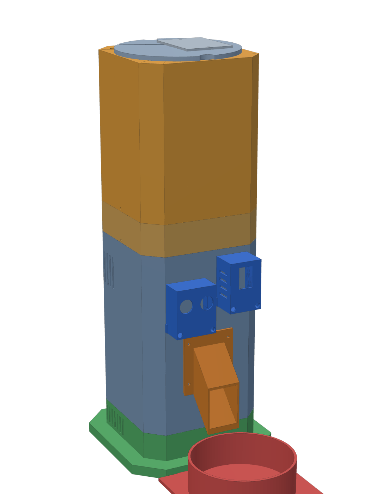
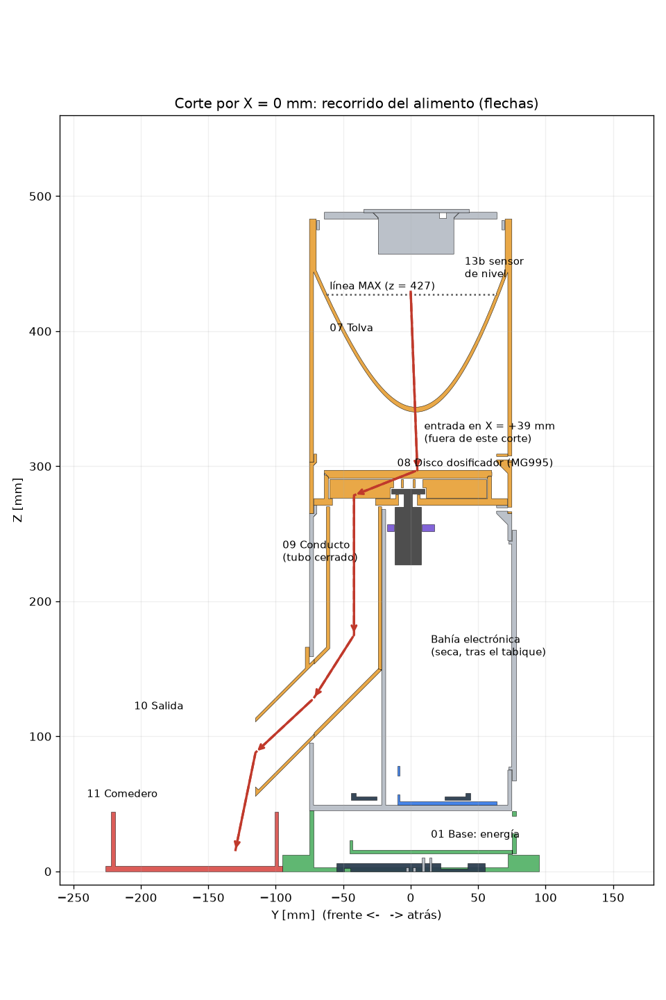
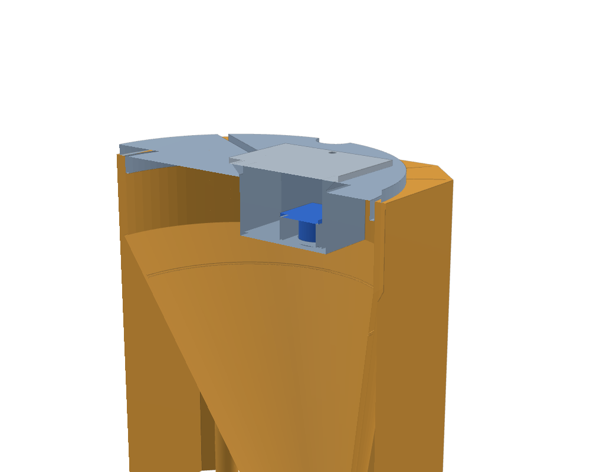
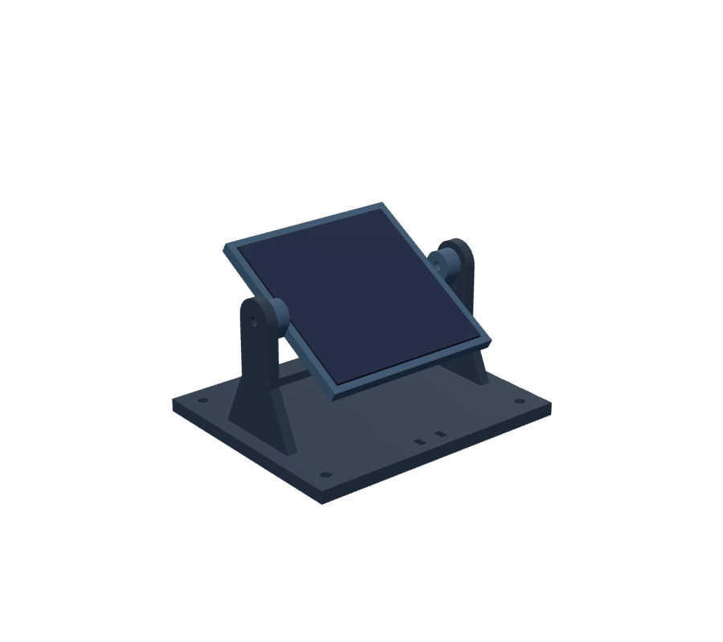
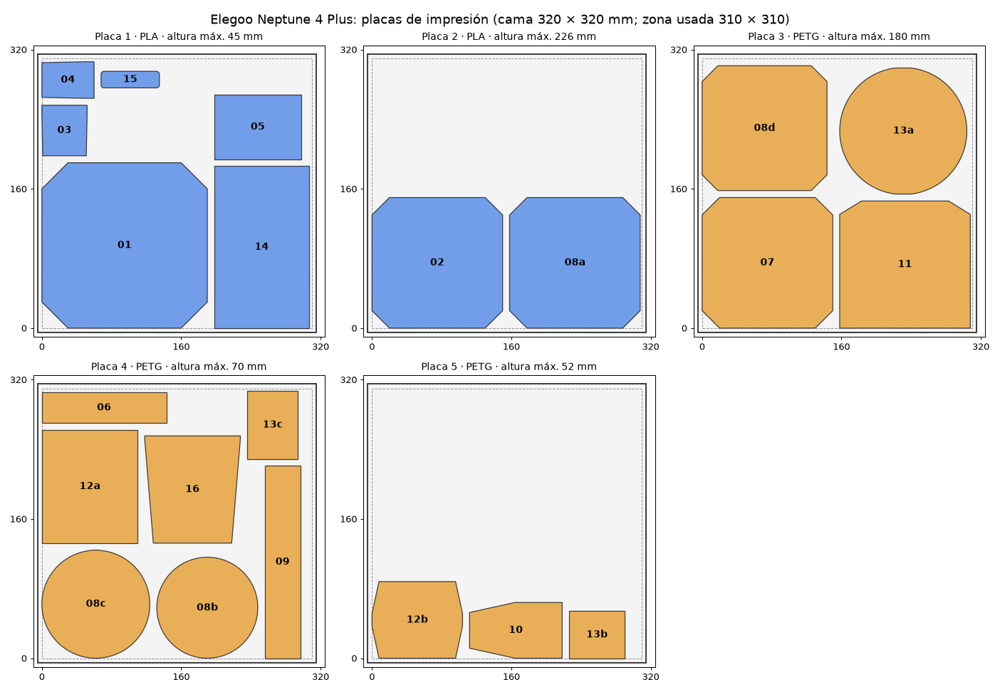
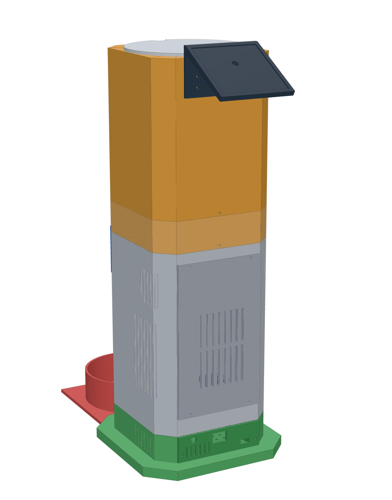
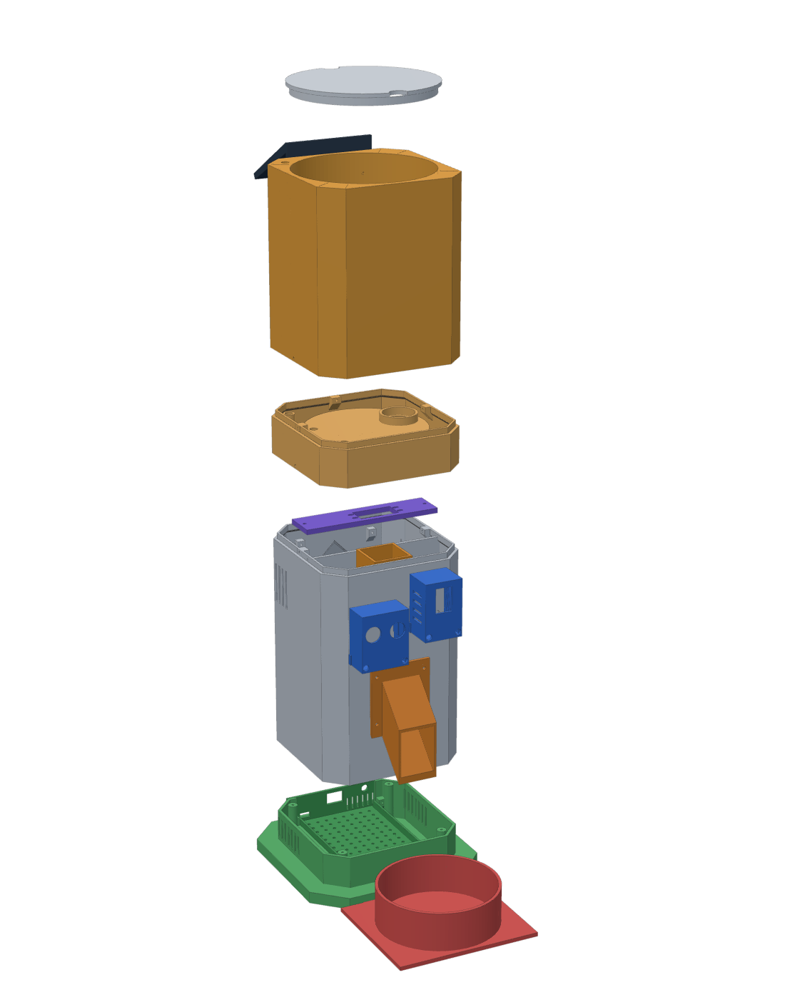
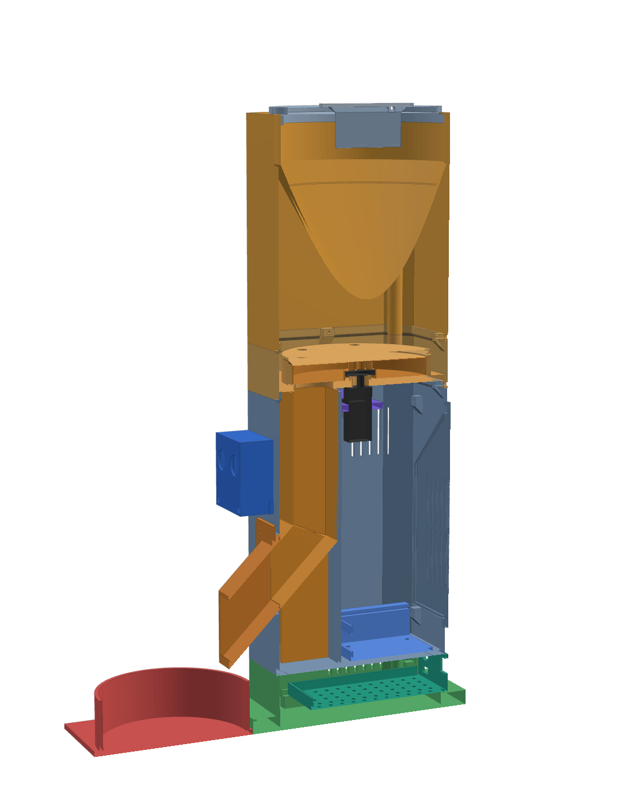

# Mecánica — Torre modular imprimible en 3D (Elegoo Neptune 4 Plus)



Todo el modelo es **paramétrico** y se genera con Python:

```bash
pip install numpy trimesh manifold3d matplotlib
python generar_stl.py      # crea STL/ (piezas ya orientadas) y ejecuta 45 verificaciones automáticas
python plan_impresion.py   # placas para la Neptune 4 Plus + filamento y tiempo (lamina con PrusaSlicer si está)
python render.py           # planos 2D: corte del recorrido del alimento y planta del dosificador
```

**Armado:** [manual paso a paso con imágenes](../Documentation/manual_armado/Manual_de_Armado.md)
([PDF](../Documentation/manual_armado/Manual_de_Armado.pdf)).

`generar_stl.py` comprueba en cada ejecución (también en GitHub Actions):

* que **ninguna pieza interfiera con otra** (19 piezas de la torre, 171 pares) ni con la envolvente del MG995;
* que el bolsillo del disco **nunca conecte** la tolva con el conducto a la vez (margen angular);
* que el interior del canal de alimento **no contenga electrónica** (ESP32, ESP32-CAM, HC-SR04, MG995, soporte);
* que la punta del pico caiga dentro del comedero y por encima de su borde;
* que las paredes de la tolva tengan **≥ 55°** (las croquetas no forman bóveda con paredes tendidas);
* **sensor de nivel:** surco MAX a ≥ 2 cm de los transductores (alcance mínimo del HC-SR04), cápsula por encima del
  alimento, HC-SR04 dentro de la cápsula, y que la tabla altura → volumen del firmware (`NivelGeometria.h`) coincida con
  esta tolva; informa a qué altura y cuánto alimento corresponden los umbrales de `config.h`;
* **estación solar:** que la bandeja gire de 0° a 75° sin tocar la base;
* que **las 22 piezas quepan en la Elegoo Neptune 4 Plus** (320 × 320 × 385 mm; se exige 310 × 310 × 380 para dejar
  margen a la falda) y tengan una cara plana de apoyo en la orientación de impresión.

> Las cotas de los componentes comprados (MG995, HC-SR04, ESP32-CAM, placa perforada, panel) son las
> **nominales** y están al principio de `generar_stl.py` (sección COMPONENTES). **Mida sus unidades con un
> calibre** y corrija esos parámetros antes de imprimir: los clones varían. El panel solar debe medirse sí o sí
> (`PANEL_W`, `PANEL_H`, `PANEL_E`).

## Piezas

`STL/` contiene cada pieza **ya orientada para imprimir** y `00_Ensamblaje_Referencia_NO_IMPRIMIR.stl`
(GitHub lo muestra en 3D).

| Pieza | Función / ubicación | Tamaño de impresión (mm) | Unión y tornillería | Orientación | Mantenimiento |
|---|---|---|---|---|---|
| 01_Base_Torre | Módulo de energía; plinto de 190 mm para estabilidad; 4 pilares de unión | 190×190×45 | 4 × M3×12 desde arriba (a través del piso de 02) | Como está | Se separa de 02 quitando 4 tornillos |
| 16_Soporte_Estructural_Cajon_Energia | Cajón deslizante: batería, BMS, convertidores, cargador; tapa trasera con interruptor, USB-C y **conector GX12 del panel remoto** | 110×123×31 | 2 × M3×10 a tetones de 01; componentes con M3 + separadores (rejilla 10 mm) | Piso abajo | Sale por detrás sin desarmar la torre |
| 02_Cuerpo_Principal | Canal de alimento (frente), tabique, bahía electrónica (atrás), frente de sensores | 150×150×226 | Labio superior + 3 × M3×10 radiales hacia 08a | Como está | Tapa de servicio trasera |
| 03_Modulo_HC_SR04 | Cápsula del HC-SR04 de presencia (horizontal, pines abajo) | 52×58×28 | 2 × M3×10 + tuerca por dentro de la pared | Cara frontal abajo | Se desatornilla desde el frente |
| 04_Modulo_ESP32_CAM | Cápsula de la ESP32-CAM, inclinada 12° hacia abajo, con ventilación | 42×60×34 | 2 × M3×10 + tuerca | Cara frontal abajo | Se desatornilla desde el frente |
| 05_Modulo_ESP32 | Bandeja con guías para una placa perforada 90×70 mm con el ESP32 | 100×74×29 | 4 × M3×10 + tuerca bajo el piso | Como está | La placa sale deslizando por la tapa trasera |
| 06_Soporte_MG995 | Viga que sostiene el servo, apoyada en dos ménsulas de 02 | 143×35×5 | 2 × M3×10 a las ménsulas; servo con 4 tornillos en ranuras | Plana | Calces (15) para ajustar la altura |
| 07_Tolva | Depósito con embudo cónico oblicuo (≥55°), **surco MAX** de llenado, ranura de la llave de la tapa y tubo cerrado en la esquina trasera izquierda para el cable del sensor de nivel | 150×150×180 | Sobre el labio de 08a + 3 × M3×10 | Como está | Se retira para limpiar; sin electrónica |
| 08a_Carcasa_Dosificador | Anillo exterior del módulo dosificador | 150×150×44 | Labio de 02 + 3 × M3×10; labio para 07 | Como está | — |
| 08b_Disco_Dosificador | Disco de 116 mm con un bolsillo de Ø28×14 mm (8,6 cm³ geométricos) | 116×116×14 | Atornillado al horn redondo del MG995 | Boca abajo | Se saca levantando 08c |
| 08c_Placa_Superior_Dosificador | Tapa del disco con la entrada (Ø28) y zócalo para la boca de la tolva | 124×124×14 | Asiento cónico + chaveta (sin tornillos) | Como está | Sale a mano para limpiar |
| 08d_Placa_Base_Dosificador | Placa con la salida (Ø32), cámara del disco, laberinto del eje, tubo de cables y marcas de calibración | 143×143×32 | Apoya sobre el labio de 02, encajada en 08a | Como está | Superficie lisa, lavable |
| 09_Conducto_Alimento | Tubo cerrado 36×36 mm: vertical + codo a 45° hacia el frente | 41×221×50 | Apoya en el piso de 02; se baja desde arriba | Acostado sobre su cara trasera | Se lava; se cepilla por dentro |
| 10_Salida_Alimento | Pico a 45° que deja caer el alimento en el comedero | 64×106×52 | 4 × M3×10 a tetones del frente de 02 | Sobre la cara inferior del tubo | Se desmonta desde fuera |
| 11_Comedero | Plato con cuenco Ø118 interior; 2 lengüetas que entran bajo el plinto | 150×146×44 | Encastre (sin tornillos) | Como está | Se saca para lavar (ver nota de higiene) |
| **12a_Estacion_Solar_Base** | Base de la **estación solar remota**: horquilla con pivote M4, bolsillo de lastre, 4 agujeros de fijación y paso de brida para el cable | 130×110×70 | 4 tornillos Ø4 o lastre | Como está | — |
| **12b_Estacion_Solar_Bandeja** | Bandeja del panel (alojamiento paramétrico + ventana para soldaduras); nudillos con **tuerca M4 alojada** | 104×88×14 | 2 × M4×12 + arandela; fija el ángulo por fricción (0–75°) | Como está | Se reorienta aflojando los M4 |
| **13a_Tapa_Superior_Tolva** | Tapa con **llave** (una sola posición), muescas para los dedos, avellanado a 45° para la cápsula, 2 tetones y **ranura del cable** hacia el tubo de la esquina | 146×145×13 | Encaje con llave | Boca abajo | Se levanta para cargar; el cable tiene holgura |
| **13b_Capsula_Sensor_Nivel** | Cápsula del **HC-SR04 n.º 2**: dos agujeros Ø16,8 para los transductores, nervios de apoyo de la placa, ala a 45° y muesca del cable | 54×64×31 | Cuelga del avellanado de 13a | Piso abajo | Sale desde arriba quitando 13c |
| **13c_Tapa_Capsula_Sensor** | Tapa de la cápsula | 58×78×2 | 2 × M3×12 a los tetones de 13a | Plana | — |
| 14_Tapa_Lateral_Servicio | Tapa trasera de la bahía electrónica (ventilada) | 109×186×6 | 4 × M3×10 | Cara exterior abajo | Acceso al ESP32, servo y cableado |
| 15_Separadores | Tubos para M3 (3, 6 y 10 mm) | 67×19×10 | — | Como está | — |

**Recorrido del alimento:** 07 → 08c (entrada) → 08b (bolsillo) → 08d (salida) → 09 → 10 → 11.
Ninguna de esas piezas contiene ni toca electrónica.



### Sensor de nivel en la tapa (recomendación del profesor)



La cápsula 13b es una pieza aparte para que se imprima **sin puentes** (piso sobre la cama) y para poder cambiar el
sensor sin reimprimir la tapa. Los transductores quedan a 26 mm bajo la cara inferior de la tapa y a **30 mm del surco
MAX** del embudo (el HC-SR04 no mide a menos de 2 cm). La capacidad hasta MAX es ≈ 632 cm³; los umbrales de alerta del
firmware son porcentajes de **volumen** (con el 20 % de la altura queda solo el 4,8 % del alimento): el generador
imprime a qué altura sobre la boca del embudo cae cada umbral.

### Estación solar remota (recomendación del profesor)



El panel ya no se atornilla a la torre: la estación se coloca donde haya sol y se une al cajón de energía con un cable
y un conector GX12. La bandeja gira sobre dos tornillos M4 que roscan en tuercas alojadas en sus nudillos (hexágono con
el vértice hacia arriba: se imprime sin puente) y se fija por fricción entre 0° y 75°; el generador verifica que en
todo ese rango no toque la base.

## Impresión en la Elegoo Neptune 4 Plus



El [plan de impresión](plan_impresion.md) agrupa las piezas en **5 placas** por material y da el filamento y el tiempo
de cada pieza laminada con PrusaSlicer (perfil equivalente: boquilla 0,4, capa 0,2 mm). Total ≈ **1,0 kg de PLA +
1,25 kg de PETG**, ≈ 86 h de impresión.

| Parámetro | Valor recomendado |
|---|---|
| Laminador | Elegoo Cura u OrcaSlicer con el perfil **Elegoo Neptune 4 Plus**; importar los STL **sin rotarlos** |
| Material en contacto con alimento (07, 08b, 08c, 08d, 09, 10, 11) y tapa (13a, 13b, 13c) | **PETG** apto para contacto con alimentos (o PLA de color natural sin aditivos); boquilla de acero inoxidable si se busca aptitud alimentaria |
| Estación solar (12a, 12b) | **PETG o ASA** (sol y lluvia; el PLA se ablanda a ~55–60 °C al sol) |
| Viga del servo (06) y cajón de energía (16) | PETG (rigidez sostenida y calor de los convertidores) |
| Resto de la estructura (01, 02, 03, 04, 05, 08a, 14, 15) | PLA (o PETG) |
| Capa | 0,2 mm (0,16 mm en 08b y 08c para mejor acabado de la superficie de deslizamiento) |
| Perímetros | 3 (las paredes de 3 mm quedan macizas con boquilla de 0,4 mm) |
| Relleno | 20 % giroide; 40 % en 06, 08b, 12a, 12b y 16 |
| Temperaturas orientativas | PLA 210 °C / cama 60 °C; PETG 240 °C / cama 75 °C (use las de su filamento) |
| Soportes | **No hacen falta.** Puentes presentes: techo de la abertura del pico (42 mm), techo interior del conducto y del pico (36–37 mm), esquinas del anillo superior de la tolva (≤ 17 mm), brida del pico a 45°, orejetas internas de los pods (≤ 8 mm apoyadas en dos paredes), túnel de la brida en 12a (16 mm). El ala de la cápsula 13b y el avellanado de 13a están exactamente a 45° |
| Adherencia | La placa PEI de la Neptune 4 Plus agarra bien el PLA; para PETG use la cara texturizada o pegamento en barra (el PETG se pega demasiado a la PEI lisa). Borde (brim) de 5 mm en 02 y 07 si se despegan las esquinas |
| Tolerancias | Encaje entre módulos 0,3 mm por lado; ranuras de placas 1,8–2,0 mm; agujeros pasantes M3 Ø3,4; agujeros para rosca en plástico Ø2,5; M4 pasante Ø4,4; tuerca M4 en hexágono de 7,3 mm entre caras |
| Prueba previa | Imprimir primero 06, 15 y 13c (rápidas) y comprobar el MG995 y los tornillos antes de las piezas grandes |

**Higiene:** las superficies impresas tienen microsurcos entre capas. Lavar con agua tibia y jabón (no
lavavajillas: el PLA/PETG se deforma), secar bien antes de volver a cargar alimento. Para uso prolongado se
recomienda apoyar un cuenco de acero inoxidable sobre el comedero 11.

## Orden de montaje (resumen)

El detalle, con una imagen por paso, la tornillería exacta y las comprobaciones, está en el
[manual de armado](../Documentation/manual_armado/Manual_de_Armado.md).

1. **Cajón de energía (16)** con sus módulos (ajustar Buck A = 6,0 V y Buck B = 5,0 V **antes**) y el GX12 → deslizar
   en la base (01).
2. **Cuerpo (02):** bandeja 05 y cápsulas 03/04 **antes** de unirlo a la base (4 × M3×12 desde arriba).
3. **Conducto (09)** desde arriba y **pico (10)** desde fuera.
4. **Servo:** centrarlo con `SERVO 1500`, atornillarlo a la viga 06 y apoyarla en las ménsulas.
5. **08a** sobre el labio de 02 y **08d** dentro de 08a.
6. **Disco 08b** en la marca CERRADO; **calibrar** las posiciones con las marcas a la vista.
7. **08c** con la chaveta en su chavetero.
8. **Tolva 07** (boca en el zócalo de 08c, tubo de cables atrás a la izquierda).
9. **Tapa 13a + cápsula 13b con el HC-SR04 n.º 2 + 13c**; cable por la ranura y el tubo de la esquina hasta J5;
   calibrar `NIVEL VACIO` / `NIVEL LLENO`.
10. **Tapa de servicio 14** y **comedero 11**.
11. **Estación solar 12a + 12b** con el panel, al sol; enchufar el GX12 con S1 apagado.

## Otras vistas

| Atrás | Explosionada | Corte |
|---|---|---|
|  |  |  |
