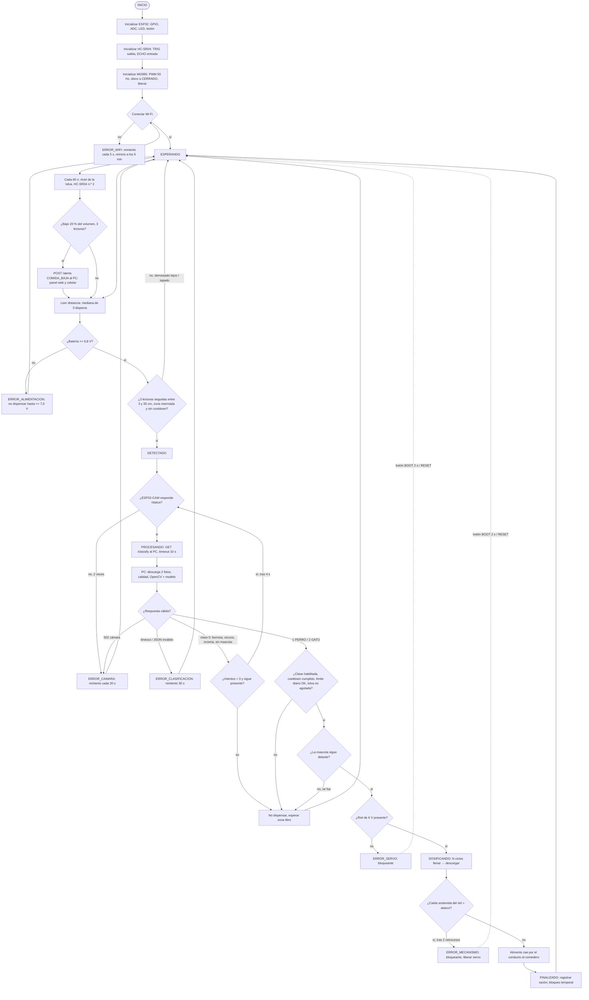
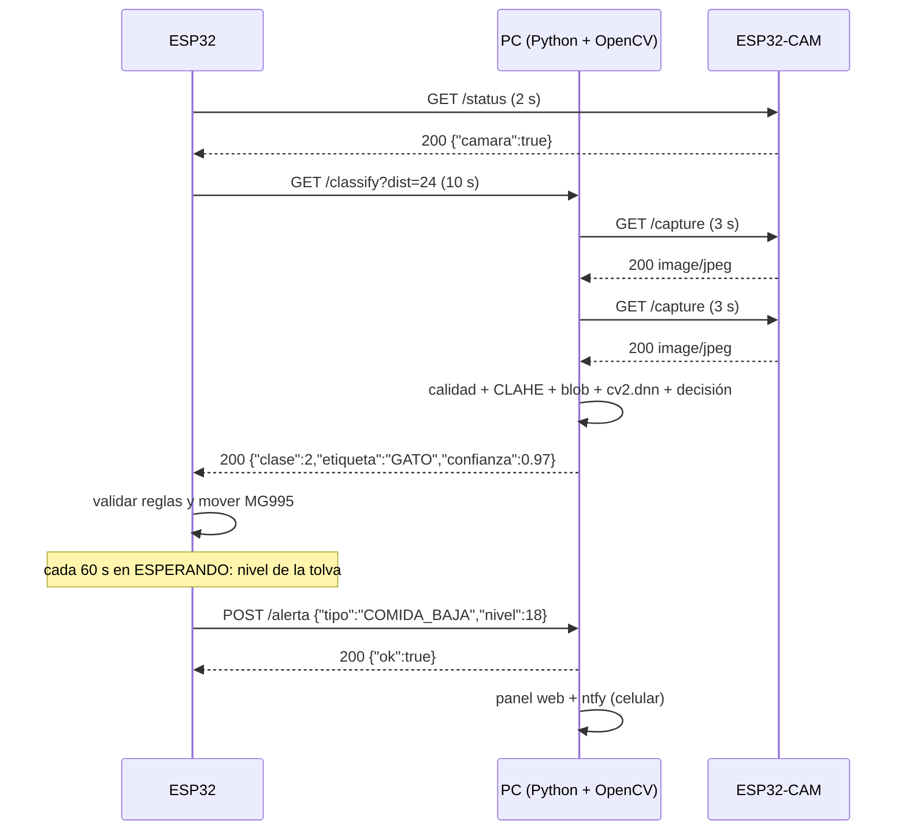
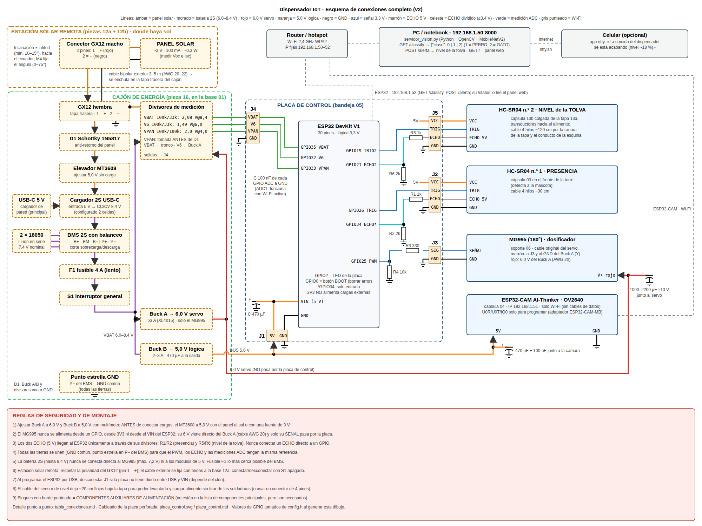
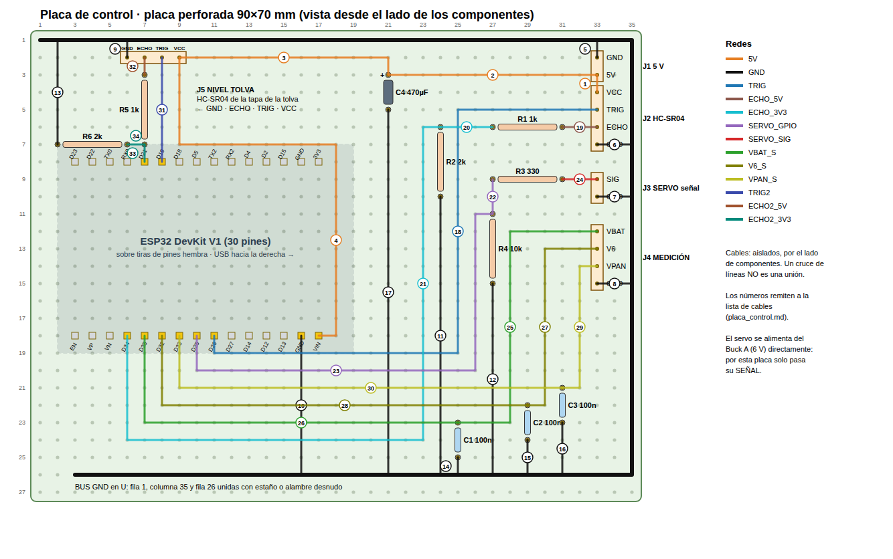
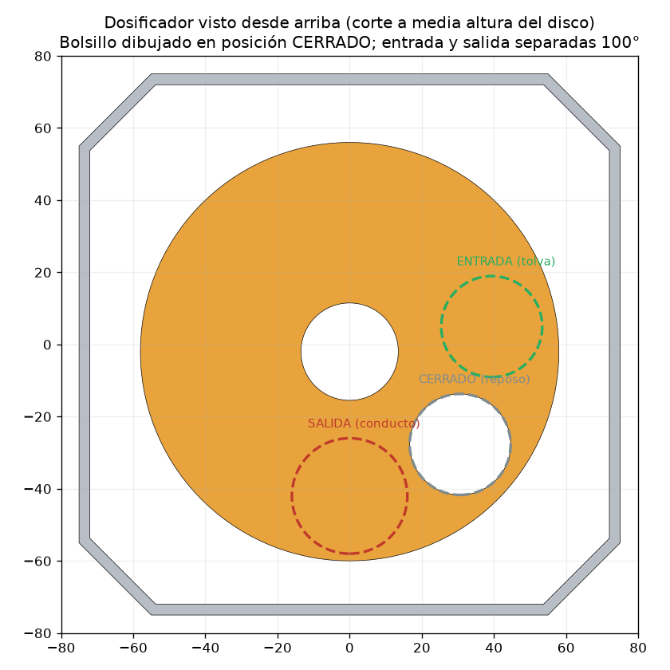
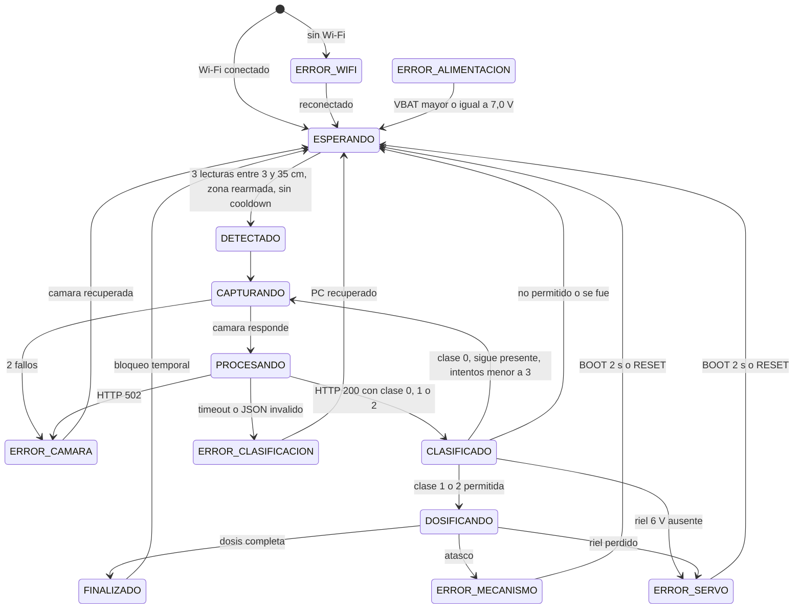

# Dispensador inteligente de alimento para mascotas mediante IoT, visión artificial y energía solar


Proyecto universitario para feria de informática. Este repositorio contiene **todo** lo necesario para
construirlo y probarlo: firmware del ESP32 y de la ESP32-CAM, servidor de visión en Python + OpenCV,
22 piezas STL paramétricas listas para la **Elegoo Neptune 4 Plus**, [manual de armado](Documentation/manual_armado/Manual_de_Armado.md)
([PDF](Documentation/manual_armado/Manual_de_Armado.pdf)), esquema eléctrico completo, cálculo energético, procedimientos
de calibración y plan de pruebas.

> **Cómo se elaboró (técnica ROL – TAREA – CONTEXTO).**
> **ROL:** equipo de ingeniería electrónica, sistemas embebidos/IoT, visión artificial, mecánica/diseño 3D,
> arquitectura de software y asesoría académica. **TAREA:** auditar el planteamiento inicial, corregirlo donde
> no era físicamente correcto y entregar un sistema construible. **CONTEXTO:** hardware principal fijado
> (ESP32 DevKit V1, ESP32-CAM, HC-SR04, MG995, panel solar ≈3 V/100 mA), identificación solo por visión
> artificial (1 = PERRO, 2 = GATO), torre modular impresa en 3D.
>
> **Regla de lectura:** todo valor marcado **PROVISIONAL** o **VERIFICAR** no es un dato de fábrica; se
> obtiene en la calibración. Los valores "típicos" se citan con su fuente y deben medirse.

> **Recomendaciones del profesor incorporadas (versión 2):**
> 1. **El panel solar va aparte**, en una **estación solar remota** (piezas 12a + 12b) que se coloca donde haya sol, a
>    3–5 m, unida al cajón de energía por un cable con conector **GX12**. La bandeja se orienta de 0° a 75° (§21, §31).
> 2. **Sensor ultrasónico dentro de la tolva:** un **segundo HC-SR04** en la tapa mide el nivel de alimento y el ESP32
>    envía una **alerta** al PC (panel web y, opcionalmente, notificación al celular con ntfy) cuando la comida se está
>    acabando (§18, §24, §25).
>
> Además: todas las piezas se verificaron para el volumen de la **Elegoo Neptune 4 Plus** (320 × 320 × 385 mm) con un
> [plan de impresión](Mechanical/plan_impresion.md) por placas, hay un [manual de armado paso a paso](Documentation/manual_armado/Manual_de_Armado.md)
> y un [esquema de conexiones completo](Documentation/wiring/esquema_conexiones.svg) con su
> [tabla punto a punto](Documentation/wiring/tabla_conexiones.md).

## Índice

1. [Resumen ejecutivo](#1-resumen-ejecutivo) · 2. [Objetivo general](#2-objetivo-general) · 3. [Objetivos específicos](#3-objetivos-específicos) · 4. [Componentes definitivos](#4-componentes-definitivos) · 5. [Componentes eliminados](#5-componentes-eliminados) · 6. [Función de cada componente](#6-función-de-cada-componente) · 7. [Arquitectura general](#7-arquitectura-general) · 8. [Flujo completo](#8-flujo-completo) · 9. [Diagrama de bloques](#9-diagrama-de-bloques) · 10. [Arquitectura ESP32](#10-arquitectura-esp32) · 11. [Arquitectura ESP32-CAM](#11-arquitectura-esp32-cam) · 12. [Arquitectura Python + OpenCV](#12-arquitectura-python--opencv) · 13. [Comunicación entre dispositivos](#13-comunicación-entre-dispositivos) · 14. [Esquema eléctrico](#14-esquema-eléctrico) · 15. [Tabla de conexiones pin por pin](#15-tabla-de-conexiones-pin-por-pin) · 16. [Alimentación eléctrica](#16-alimentación-eléctrica) · 17. [Análisis del MG995](#17-análisis-del-mg995) · 18. [Análisis del HC-SR04](#18-análisis-del-hc-sr04) · 19. [Análisis del ESP32](#19-análisis-del-esp32) · 20. [Análisis de la ESP32-CAM](#20-análisis-de-la-esp32-cam) · 21. [Análisis del sistema solar](#21-análisis-del-sistema-solar) · 22. [Dosificación](#22-dosificación) · 23. [Calibración](#23-calibración) · 24. [Máquina de estados](#24-máquina-de-estados) · 25. [Manejo de errores](#25-manejo-de-errores) · 26. [Seguridad](#26-seguridad) · 27. [Diseño mecánico](#27-diseño-mecánico) · 28. [Diseño de la torre](#28-diseño-de-la-torre) · 29. [Distribución física de los componentes](#29-distribución-física-de-los-componentes) · 30. [Recorrido del alimento](#30-recorrido-del-alimento) · 31. [Piezas STL necesarias](#31-piezas-stl-necesarias) · 32. [Recomendaciones de impresión 3D](#32-recomendaciones-de-impresión-3d) · 33. [Tecnologías utilizadas](#33-tecnologías-utilizadas) · 34. [Estructura del software](#34-estructura-del-software) · 35. [Estructura de archivos](#35-estructura-de-archivos) · 36. [Algoritmo](#36-algoritmo) · 37. [Código propuesto](#37-código-propuesto) · 38. [Plan de pruebas](#38-plan-de-pruebas) · 39. [Problemas posibles](#39-problemas-posibles) · 40. [Soluciones](#40-soluciones) · 41. [Lista de verificación](#41-lista-de-verificación) · 42. [Auditoría técnica final](#42-auditoría-técnica-final)

---

## 1. Resumen ejecutivo

El dispensador es una **torre modular de ≈ 49 cm** impresa en 3D. Cuando una mascota se acerca, el **HC-SR04**
la detecta; el **ESP32** pide una clasificación al **PC**, que descarga una foto de la **ESP32-CAM** por Wi-Fi y la
analiza con **Python + OpenCV** usando una red neuronal **MobileNetV2** ejecutada por `cv2.dnn`. El PC responde
`1 = PERRO`, `2 = GATO` o `0 = INDETERMINADO`. El ESP32 **decide** si corresponde dispensar (clase válida,
tiempo mínimo entre raciones, límite diario, batería y servo correctos, mascota todavía presente) y mueve el
**MG995**, que gira un **disco volumétrico**: cada ciclo entrega un volumen fijo de alimento que cae por un
**conducto cerrado** hasta el comedero. La electrónica está en compartimientos separados del alimento. Un **segundo
HC-SR04** en la tapa de la tolva mide cuánto alimento queda y el ESP32 **avisa** al PC (y al celular) cuando se está
acabando. El **panel solar** está en una **estación remota** orientable, donde haya sol, unida a la torre por un cable.

**La auditoría previa encontró errores en el planteamiento inicial que se corrigieron** (detalle en §7 y §42):

| # | Planteamiento inicial | Problema real | Corrección aplicada |
|---|---|---|---|
| 1 | El panel solar alimenta el sistema | Panel ≈ 0,3 W pico; el sistema consume ≈ 1,7 W **promedio** (picos de 20 W con el servo trabado). El panel aporta ≈ 1,7 % de la energía diaria al sol y ≈ 0,03 % en interior | Batería 2S Li-ion + BMS + convertidores. El panel queda como **subsistema de captación demostrativo** con medición en tiempo real; se dimensiona el panel que haría falta (≈ 14 W) |
| 2 | MG995 conectado al ESP32 | Consume 0,5–0,9 A moviéndose y ≈ 2,5 A bloqueado (no lo soporta ni un GPIO ni el regulador de 3,3 V) | Convertidor **exclusivo** de 6,0 V (≥ 3 A); el ESP32 solo da la señal; GND común |
| 3 | Batería conectada al servo | Una 2S llega a 8,4 V; el MG995 admite 4,8–7,2 V | Siempre a través del convertidor de 6,0 V |
| 4 | ECHO del HC-SR04 directo al ESP32 | ECHO sale a 5 V; el ESP32 admite como máximo 3,6 V | Divisor 1 kΩ / 2 kΩ → 3,33 V en GPIO34 |
| 5 | "OpenCV reconoce perros y gatos" | OpenCV no clasifica por sí solo | OpenCV procesa y ejecuta un **modelo entrenado** (MobileNetV2, ImageNet). Se suman las 118 razas de perro y los 5 gatos domésticos |
| 6 | Resultado solo 1 o 2 | Hace falta un valor para "no sé / imagen mala" | Se añade **0 = INDETERMINADO → no dispensar** (1 y 2 se mantienen exactos) |
| 7 | Capas apiladas: tolva → MG995 → ESP32-CAM → HC-SR04 → ESP32 → salida | El alimento atravesaría las capas de electrónica | Columna de alimento **cerrada** al frente, tabique, bahía electrónica atrás, sensores en cápsulas frontales, energía en la base |
| 8 | Sinfín como dosificador | Un sinfín necesita giro continuo; el MG995 estándar gira ≈ 180° y se traba con croquetas | **Disco volumétrico de un bolsillo** con vaivén de 100° (compatible con servo posicional) |
| 9 | "90° = 80 g" | No existe relación fija ángulo-gramos | Ración = **N ciclos**; gramos por ciclo medidos con balanza (procedimiento §23) |
| 10 | ESP32 recibe la imagen | Innecesario y costoso en RAM | El **PC pide la foto directamente a la cámara**; el ESP32 solo recibe el JSON |

**Qué está verificado y qué no.** Verificado en este repositorio (y de nuevo en cada `push` por GitHub
Actions, `.github/workflows/verificacion.yml`):

* **Firmware compilado con la cadena oficial de Espressif** (Arduino-ESP32 **2.0.17** y **3.0.7**, `--warnings all`,
  sin advertencias propias): ESP32 960 kB / 1 097 kB (73 % / 83 % de la flash), ESP32-CAM 847 kB / 1 023 kB.
* **Firmware del ESP32 ejecutado en el emulador QEMU de Espressif**: arranca, entra en la máquina de estados y
  responde a todos los comandos, incluido `NIVEL` (autoprueba de 14 puntos). El emulador encontró un error real que se
  corrigió (el botón BOOT mantenido borraba errores cada 50 ms).
* 24 escenarios de la máquina de estados en PC (5 del sensor de nivel: alerta única, tolva vacía, recarga parcial,
  sensor sin lectura, reintento si el PC no recibe la alerta); 22 pruebas del servicio de visión (extremo a extremo por
  HTTP, alertas, panel web y reenvío al celular); **modelo real** sobre 25 imágenes públicas: 9/9 perros, 5/5 gatos y 0
  errores peligrosos con 11 animales parecidos (lobo, coyote, dingo, zorros, hiena, puma, lince, tigre, guepardo) y un peluche.
* 45 comprobaciones geométricas (cero interferencias en 171 pares, recorrido del alimento continuo, cápsula del sensor
  de nivel fuera del alimento, bandeja solar libre de 0° a 75°, **las 22 piezas caben en la Neptune 4 Plus**) y la
  placa de control y el esquema se regeneran desde `config.h` (fallan si un pin no coincide).

**Pendiente de prueba física** (no se puede hacer sin el hardware): consumos reales, calibración de posiciones y
gramos, umbrales con la cámara instalada, Wi-Fi y cámara reales, comportamiento del panel. El plan de pruebas (§38)
cubre cada punto.

## 2. Objetivo general

Diseñar, construir y validar un dispensador automático de alimento para mascotas, con estructura de torre
modular impresa en 3D, que identifique por visión artificial si la mascota que se acerca es un perro o un gato y
entregue una ración calibrada solo cuando corresponda, integrando IoT (Wi-Fi/HTTP), visión artificial
(Python + OpenCV) y un subsistema de energía con captación solar analizado de forma realista.

## 3. Objetivos específicos

1. Detectar la aproximación de una mascota con el HC-SR04 de forma robusta (mediana, confirmación y rearmado).
2. Capturar imágenes con la ESP32-CAM y transmitirlas por Wi-Fi al PC bajo demanda.
3. Clasificar la imagen en Python + OpenCV como **1 = PERRO** o **2 = GATO**, devolviendo **0** si la confianza o
   la calidad de imagen no son suficientes.
4. Implementar en el ESP32 una máquina de estados que valide la decisión y gestione errores reales.
5. Accionar el MG995 con alimentación independiente y un mecanismo de dosificación repetible.
6. Garantizar un recorrido físico del alimento continuo y separado de la electrónica.
7. Diseñar una torre modular, desmontable e imprimible sin soportes.
8. Analizar la energía (consumo, picos, autonomía, aporte solar) sin afirmaciones imposibles.
9. Definir procedimientos de calibración y un plan de pruebas con criterios de aprobación.
10. Medir el nivel de alimento de la tolva con un segundo HC-SR04 y **avisar** cuando se esté por acabar (recomendación
    del profesor).
11. Separar la captación solar en una **estación remota** orientable, ubicada donde haya sol (recomendación del profesor).

## 4. Componentes definitivos

**Componentes funcionales principales (los únicos del proyecto):**

| Componente | Cant. | Papel |
|---|---|---|
| ESP32 DevKit V1 (ESP32-WROOM-32, 30 pines) | 1 | Controlador y actuador |
| ESP32-CAM AI-Thinker (OV2640) | 1 | Captura de imágenes |
| HC-SR04 (versión de 5 V) | **2** | n.º 1: detección de aproximación (frente) · n.º 2: **nivel de alimento en la tolva** (tapa) |
| Servomotor MG995 (versión **180°**, no la de giro continuo) | 1 | Accionamiento del dosificador |
| Panel solar ≈ 3 V / 100 mA (con cable) | 1 | Captación solar (demostrativa), en la **estación remota** |

**COMPONENTES AUXILIARES DE ALIMENTACIÓN** (no son "funcionales", pero sin ellos el sistema no es
eléctricamente posible; ver §16 y §21):

| Componente | Cant. | Por qué es necesario |
|---|---|---|
| Celdas Li-ion 18650 (marca/capacidad verificable) | 2 (o 4 para 2S2P) | Almacenamiento: el panel no puede alimentar el sistema en tiempo real |
| Portapilas 2S (2×18650 en serie) | 1 | Montaje seguro de las celdas |
| BMS 2S con balanceo, ≥ 5 A, puerto común | 1 | Protege contra sobrecarga, sobredescarga y cortocircuito |
| Cargador elevador USB-C 5 V → 2S (8,4 V CC/CV) | 1 | Carga principal desde un cargador USB |
| Elevador MT3608 (ajustable) | 1 | Eleva los ≈ 3 V del panel a 5 V para la entrada del cargador |
| Diodo Schottky 1N5817 | 1 | Evita que el circuito descargue hacia el panel |
| Convertidor reductor **Buck A** ≥ 3 A (p. ej. módulo XL4015) | 1 | 6,0 V **exclusivo** del MG995 |
| Convertidor reductor **Buck B** 2–3 A (p. ej. LM2596 o MP1584) | 1 | 5,0 V para ESP32, ESP32-CAM y HC-SR04 |
| Fusible 4 A lento + portafusible | 1 | Protección del cableado de batería |
| Interruptor basculante (≥ 6 A) | 1 | Corte general |

Lista de compras completa (con cantidades) en
[`Documentation/components/lista_materiales.csv`](Documentation/components/lista_materiales.csv) (se abre con Excel o
Google Sheets).

**Componentes pasivos y de montaje:** R1 1 kΩ, R2 2 kΩ (divisor ECHO de presencia); **R5 1 kΩ, R6 2 kΩ (divisor
ECHO del sensor de nivel)**; 330 Ω (serie señal servo); 10 kΩ (pull-down señal servo); 4 × 100 kΩ y 2 × 33 kΩ
(divisores de medición); 1 × 1000–2200 µF ≥ 10 V (servo); 3 × 470 µF ≥ 10 V (salida del Buck B, placa de control y
ESP32-CAM); 4 × 100 nF (3 en la placa de control junto a los ADC, 1 en la ESP32-CAM); placa perforada 90×70 mm; tiras
de pines hembra; conectores entre módulos (JST-XH o XT30); **conector GX12 de 2 pines (macho + hembra) y 3–5 m de cable
bipolar de exterior** para la estación solar; **cable de 4 hilos de ~120 cm** para el sensor de nivel; cable AWG 20
(potencia) y AWG 24 (señal); tornillería: 26 × M3×10, 6 × M3×12, 8 tuercas M3 (+ repuestos), 2 × M4×12 con tuerca y
arandela (pivote de la estación solar); adaptador USB-TTL 3,3 V o placa ESP32-CAM-MB (solo para programar la cámara);
PC/notebook con Wi-Fi; router o punto de acceso 2,4 GHz.

## 5. Componentes eliminados

No forman parte del sistema y **no se usan en ningún archivo**: RC522, RFID, NFC, tags NFC/RFID, sensor PIR,
cualquier otro sensor de movimiento, motor paso a paso, driver DRV8825 y cualquier otro actuador. La identificación
es **exclusivamente** por visión artificial.

## 6. Función de cada componente

| Componente | Qué hace en el sistema | Qué NO hace |
|---|---|---|
| ESP32 DevKit V1 | Lee el HC-SR04, confirma presencia, pide la clasificación al PC, **decide** si dispensar, genera el PWM del servo, mide tensiones, gestiona errores, expone `/status` | No procesa imágenes, no alimenta el servo |
| ESP32-CAM | Toma una foto JPEG cuando el PC la pide (`/capture`) | No clasifica, no se conecta por cable al ESP32 |
| HC-SR04 n.º 1 (presencia) | Mide distancia (ultrasonido 40 kHz) para saber si hay algo delante del comedero | No distingue perro, gato, persona u objeto |
| HC-SR04 n.º 2 (nivel) | Desde la tapa, mide la distancia a la superficie del alimento → % de volumen restante → alertas | No mide gramos (depende de la densidad del alimento) |
| MG995 | Gira el disco dosificador entre las posiciones LLENADO, DESCARGA y CERRADO | No "sabe" cuántos gramos entrega; no informa su posición |
| Panel solar (estación remota) | Capta energía (aporte pequeño) donde haya sol y su tensión se mide como indicador de irradiancia | No alimenta el sistema ni el servo |
| PC + Python + OpenCV + modelo | Descarga la foto, verifica su calidad, ejecuta la red neuronal y devuelve 1/2/0; recibe las alertas de nivel y las muestra (panel web) o las reenvía al celular | No controla el servo ni decide las raciones |
| Batería + BMS + convertidores | Almacenan energía y entregan 6,0 V (servo) y 5,0 V (lógica) estables | — |

## 7. Arquitectura general

### 7.1 Auditoría de la arquitectura propuesta

La cadena conceptual MASCOTA → HC-SR04 → ESP32 → ESP32-CAM → Wi-Fi → PC → OpenCV → 1/2 → ESP32 → MG995 →
dosificador → conducto → comedero es **correcta en sus responsabilidades**, pero se precisan tres puntos:

1. **Quién transporta la imagen.** Si el ESP32 recibiera la foto para reenviarla al PC, necesitaría decenas de kB
   de RAM y el doble de tráfico. **Mejor:** el ESP32 hace una sola petición `GET /classify` al PC; el PC (cliente)
   descarga la foto directamente de la ESP32-CAM (servidor) y contesta al ESP32 en la misma respuesta HTTP.
2. **No hay cables de datos entre ESP32 y ESP32-CAM.** Todo es por Wi-Fi; solo comparten la alimentación de 5 V y GND.
   Así se evita usar los pocos GPIO libres de la ESP32-CAM (casi todos están ocupados por la cámara).
3. **La decisión final es del ESP32**, no del PC: el PC solo informa qué ve. El ESP32 aplica reglas de seguridad
   (cooldown, límite diario, batería, servo, mascota todavía presente). Si el PC falla, el sistema **no dispensa**.

### 7.2 Arquitectura definitiva

```
                         Wi-Fi 2,4 GHz (router o punto de acceso)
        ┌───────────────────────────────┬──────────────────────────────────┐
        │                               │                                  │
┌───────┴────────┐  1) GET /classify  ┌─┴───────────────────────┐  2) GET /capture ┌──────────────┐
│ ESP32 DevKit V1│ ─────────────────▶ │ PC / NOTEBOOK           │ ───────────────▶ │  ESP32-CAM   │
│ 192.168.1.52   │                    │ 192.168.1.50:8000       │ ◀─────────────── │ 192.168.1.51 │
│ máquina estados│ ◀───────────────── │ Python + OpenCV (dnn)   │   JPEG 640×480   │ solo captura │
│                │ 3) {"clase":1|2|0} │ + MobileNetV2 (ONNX)    │                  └──────────────┘
└──┬─────┬───┬───┘                    └─────────────────────────┘
   │     │   │ PWM 50 Hz (solo señal)
   │     │   └──────────────▶ MG995 ◀── 6,0 V (Buck A) ── disco dosificador ── conducto ── comedero
   │     ├── TRIG/ECHO(divisor) ── HC-SR04 n.º 1 (presencia, 5 V)
   │     └── TRIG2/ECHO2(divisor) ── HC-SR04 n.º 2 (nivel de la tolva) ──▶ 4) POST /alerta al PC ──▶ panel web / ntfy
   └── ADC: batería, riel 6 V, panel (estación solar remota ── cable 3–5 m ── GX12 ── cajón de energía)
```

## 8. Flujo completo



**Situaciones reales cubiertas:** mascota demasiado lejos (no supera el umbral), mascota que se va (se comprueba
antes de dispensar y antes de reintentar), imagen borrosa/oscura/sobreexpuesta/ inválida (clase 0), clasificación
incierta o ambigua (clase 0), Wi-Fi caído (ERROR_WIFI, reconexión y reinicio), ESP32-CAM sin respuesta
(ERROR_CAMARA), PC sin respuesta (ERROR_CLASIFICACION), servo sin alimentación (ERROR_SERVO), atasco
(ERROR_MECANISMO), batería baja (ERROR_ALIMENTACION), panel insuficiente (no bloquea: la batería manda; se informa
en `/status`), activaciones repetidas (cooldown global, cooldown por clase, límite diario y rearmado por zona libre),
**comida por acabarse** (alerta COMIDA_BAJA), **tolva vacía** (COMIDA_AGOTADA: no gira en vacío), **sensor de nivel
sin eco** (aviso, no bloquea) y **PC que no recibe la alerta** (reenvío cada 30 s).

## 9. Diagrama de bloques

```
                 MASCOTA
                    │ (ultrasonido)
                    ▼
     HC-SR04 n.º 2 (tolva) ──TRIG2/ECHO2 (divisor 1k/2k)──┐  nivel → alertas (POST /alerta)
                 HC-SR04 ──TRIG/ECHO (divisor 1k/2k)──┤
                                                      ▼
                                                   ESP32 ◀──────────────────────────────┐
                                                      │                                 │
                         ┌────────────────────────────┴───────────────┐                 │
                         │ Wi-Fi: GET /classify                       │ PWM (solo señal)│
                         ▼                                            ▼                 │
                  PC / NOTEBOOK ──GET /capture──▶ ESP32-CAM         MG995 ◀── 6,0 V     │
                  Python + OpenCV ◀──── JPEG ────                     │                 │
                  + MobileNetV2                                       ▼                 │
                         │                                   DISCO DOSIFICADOR          │
                         ▼                                            │                 │
                  1 = PERRO / 2 = GATO / 0 = no dispensar             ▼                 │
                         │                                     CONDUCTO CERRADO         │
                         └──────────────── JSON ──────────────────────┼─────────────────┘
                                                                      ▼
                                                                  COMEDERO

     ESTACIÓN SOLAR REMOTA: PANEL ─(cable 3–5 m, GX12)─▶ D1 ─▶ ELEVADOR 5 V ─▶ CARGADOR 2S ─▶ BMS + 2×18650 ─▶ F1 ─▶ S1 ─┬─▶ BUCK A 6,0 V ─▶ MG995
     USB-C 5 V ────────────────────────────────────────────────────┘                                   └─▶ BUCK B 5,0 V ─▶ ESP32, ESP32-CAM, 2 × HC-SR04
```

## 10. Arquitectura ESP32

* **Entorno:** C++ con el núcleo Arduino-ESP32 (2.x o 3.x); se abre igual en **Arduino IDE** y en **PlatformIO**
  (`ESP32/platformio.ini` apunta a la carpeta del sketch). Biblioteca externa: **ArduinoJson 7**.
* **Módulos** (cada uno con una responsabilidad):

| Módulo | Responsabilidad | Hardware |
|---|---|---|
| `Controlador` | Máquina de estados y reglas de decisión. **No incluye `Arduino.h`**: se prueba en PC | Ninguno (usa la interfaz `Hardware`) |
| `Ultrasonico` | Disparo de 10 µs, `pulseIn` con timeout 30 ms, mediana de N, ≥ 60 ms entre disparos | GPIO26, GPIO34 |
| `Dosificador` | PWM LEDC 50 Hz/16 bits, rampa (10 µs cada 10 ms), ciclo llenar/descargar, agitación, retroceso ante atasco, liberación del servo | GPIO25 |
| `Energia` | `analogReadMilliVolts` (calibración eFuse), promedio de 16 muestras, factores de divisor | GPIO35, 32, 33 |
| `NivelTolva` + `NivelGeometria.h` | HC-SR04 n.º 2: mediana de 5, calibración VACIO/LLENO guardada en la flash (NVS), altura → **% de volumen** con la tabla calculada del embudo | GPIO19, GPIO21 |
| `Red` | Wi-Fi con IP fija, reconexión, cliente HTTP con timeouts, servidor `/status`, `POST /alerta` al PC | Wi-Fi |
| `Dispensador_ESP32.ino` | Une los módulos (`HardwareReal`), lazo de 50 ms, comandos serie, LED | GPIO2, GPIO0 |

* **Patrón:** la máquina de estados depende de una interfaz abstracta `Hardware`; en el ESP32 la implementa
  `HardwareReal` y en las pruebas de PC un `FakeHW`. Así se probaron 24 escenarios sin placa.
* **Sin bloqueos largos:** el lazo corre cada 50 ms; las únicas esperas largas son la petición HTTP (máx. 10 s,
  con timeout) y la dosis (el servo debe completar el ciclo).

## 11. Arquitectura ESP32-CAM

* Firmware mínimo (`ESP32_CAM/Camara_ESP32CAM`): inicializa la cámara (pines fijos AI-Thinker), se conecta al Wi-Fi
  con IP fija y ofrece dos rutas HTTP: `GET /capture` (JPEG nuevo) y `GET /status` (diagnóstico).
* **Imagen:** VGA 640×480, JPEG calidad 12, doble búfer en PSRAM con `CAMERA_GRAB_LATEST`; antes de responder se
  descarta un cuadro para entregar siempre una foto **actual**.
* **Robustez:** reintento de inicialización de la cámara cada 10 s si falla; reconexión Wi-Fi cada 5 s; reinicio a
  los 2 min sin red; LED rojo (GPIO33) encendido si hay problema; flash desactivado por defecto.
* **Programación:** no tiene USB: placa ESP32-CAM-MB o adaptador USB-TTL de 3,3 V con GPIO0 a GND al cargar.

## 12. Arquitectura Python + OpenCV

Responsabilidades separadas (§32 de la consigna):

| Elemento | Responsabilidad |
|---|---|
| **ESP32-CAM** | Captura (y nada más) |
| **Python** (`servidor_vision.py`) | Ejecuta el programa en el PC: servidor HTTP, descarga de fotos, registro |
| **OpenCV** (`clasificador.py`) | `cv2.imdecode` (valida el JPEG), brillo medio, **varianza del Laplaciano** (nitidez), **CLAHE** (contraste en interiores), `cv2.dnn.blobFromImage` (224×224, RGB, escala) y **ejecución de la red con `cv2.dnn`** |
| **Modelo** MobileNetV2 (ONNX Model Zoo, ImageNet-1k, Apache-2.0, 14 MB) | Interpreta la imagen: 1000 probabilidades |
| **Regla de decisión** (`decidir`) | P(perro) = Σ índices 151–268 (118 razas); P(gato) = Σ índices 281–285 (gatos domésticos) |
| **Alertas** (`alertas.py`) | Recibe `POST /alerta` del ESP32 (nivel de la tolva), guarda las últimas, las muestra en el **panel web** (`GET /`) y, si se configura un tema de **ntfy**, las reenvía al celular |
| **ESP32** | Control y actuación |

**Por qué este modelo y no uno en la ESP32-CAM:** MobileNetV2 necesita ≈ 14 MB de pesos y ≈ 300 millones de
operaciones por imagen; la ESP32-CAM tiene 4 MB de PSRAM y 520 kB de SRAM, por lo que **no es adecuada** para
este modelo. Modelos diminutos en la ESP32 (p. ej. TinyML) exigirían entrenar uno propio y ofrecerían menor
precisión; la arquitectura híbrida Edge (captura) / PC (inferencia) es la más realista para el prototipo.

**Regla de decisión (valores PROVISIONALES, se ajustan con `probar_imagenes.py --barrido`):**

```
si P(perro)+P(gato) < 0,50            → 0  (SIN_MASCOTA)
si max(P(perro), P(gato)) < 0,60      → 0  (BAJA_CONFIANZA)
si |P(perro) − P(gato)| < 0,30        → 0  (AMBIGUO)
si no                                 → 1 si P(perro) > P(gato), si no 2
```

Antes del modelo, cada foto pasa un **control de calidad**: JPEG decodificable y ≥ 160×120 (si no,
`IMAGEN_INVALIDA`); brillo medio entre 35 y 225 (`IMAGEN_OSCURA` / `IMAGEN_SOBREEXPUESTA`); varianza del
Laplaciano ≥ 40 (`IMAGEN_BORROSA`). Se toman **2 fotos** y se promedian las probabilidades de las válidas.

**Resultado obtenido en este repositorio** (modelo real; `tests/descargar_imagenes_prueba.py` +
`tests/test_modelo_real.py`):

| Grupo | Imágenes | Resultado |
|---|---|---|
| Perros (chihuahua, beagle, fox terrier, golden, labrador, pastor alemán, husky, pug, caniche) | 9 | 9 × **PERRO** (P(perro) 0,66–1,00) |
| Gatos (atigrado, tiger cat, persa, siamés, egipcio) | 5 | 5 × **GATO** (P(gato) 0,74–1,00) |
| Parecidos: lobo, coyote, dingo, zorro ártico, hiena, puma, lince, tigre, guepardo, peluche, persona | 11 | 11 × **0** (`SIN_MASCOTA`; el tigre llega a P(gato) = 0,38, por debajo del umbral) |
| Zorro rojo (foto muy oscura) | 1 | **0** (`IMAGEN_OSCURA`: lo descarta el control de calidad) |

Cero decisiones peligrosas. **Aviso honesto:** son imágenes de ImageNet, el mismo conjunto con el que se entrenó el
modelo, por lo que el resultado es optimista. **No reemplaza la calibración con fotos de la cámara instalada** (§23.5).

## 13. Comunicación entre dispositivos

### 13.1 Selección del protocolo

| Opción | Ventajas | Desventajas | Decisión |
|---|---|---|---|
| **HTTP/REST** | Nativo en ESP32 (`HTTPClient`, `WebServer`) y Python (biblioteca estándar); se prueba con navegador o `curl`; petición-respuesta encaja con "pregunta → resultado" | Algo más de cabecera por mensaje | **Elegido** |
| TCP crudo | Mínimo | Hay que inventar el formato, el enmarcado y los errores | Descartado |
| MQTT | Bueno para muchos dispositivos y eventos | Requiere un *broker* adicional (Mosquitto) y no está pensado para transportar imágenes en una petición-respuesta | Innecesario para 3 equipos |
| WebSocket | Bidireccional | Complejidad sin beneficio aquí | Descartado |

### 13.2 Direcciones y roles

| Equipo | IP (configurable) | Cliente de | Servidor de |
|---|---|---|---|
| ESP32 | 192.168.1.52 (`config.h`) | PC (`/classify`, `/status`, `/alerta`), cámara (`/status`) | `/status` (puerto 80) |
| ESP32-CAM | 192.168.1.51 (`config.h` de la cámara) | — | `/capture`, `/status` (puerto 80) |
| PC | 192.168.1.50 (fijar por DHCP reservado o IP manual) | Cámara (`/capture`, `/status`), ESP32 (`/status`, para el panel), ntfy.sh (opcional) | `/classify`, `/status`, `/alerta`, `/`, `/panel.json` (puerto 8000) |

Requisitos de red: **2,4 GHz** (el ESP32 no usa 5 GHz), **WPA2-Personal** (las redes con portal cautivo o
WPA2-Enterprise de las universidades no sirven). Para la feria se recomienda un router propio o el punto de acceso
del celular, ajustando las tres IP a su subred.

### 13.3 API (solo los endpoints que realmente se usan)

| Equipo | Método y URL | Envía | Respuesta | Errores | Timeout |
|---|---|---|---|---|---|
| ESP32-CAM | `GET http://192.168.1.51/capture` | — | `200 image/jpeg` (VGA; decenas de kB según la escena) | `503` cámara no inicializada / fallo de captura | El PC espera 3 s por foto |
| ESP32-CAM | `GET http://192.168.1.51/status` | — | `200 {"camara":true,"psram":true,"fotos_ok":12,"fotos_fallidas":0,"rssi":-58,"heap":..,"uptime_s":..}` | `503` si la cámara falló | ESP32: 2 s |
| PC | `GET http://192.168.1.50:8000/classify?dist=24` | `dist` = distancia en cm (solo registro) | `200 {"clase":1,"etiqueta":"PERRO","confianza":0.93,"motivo":"OK","p_perro":0.93,"p_gato":0.01,"fotos_validas":2,"ms":640}` | `200` con `"clase":0` y `motivo` ∈ {`BAJA_CONFIANZA`,`AMBIGUO`,`SIN_MASCOTA`,`IMAGEN_BORROSA`,`IMAGEN_OSCURA`,`IMAGEN_SOBREEXPUESTA`,`IMAGEN_INVALIDA`}; `502 {"clase":0,"motivo":"CAMARA_NO_RESPONDE"}`; `500 {"clase":0,"motivo":"ERROR_INTERNO"}` | ESP32: conexión 2 s, respuesta 10 s |
| PC | `GET http://192.168.1.50:8000/status` | — | Estado del servidor, versión de OpenCV, modelo, estado de la cámara, última clasificación y umbrales | — | ESP32: 2 s |
| PC | `POST http://192.168.1.50:8000/alerta` | `{"tipo":"COMIDA_BAJA","nivel":18}` (tipo ∈ {`COMIDA_BAJA`,`COMIDA_AGOTADA`,`COMIDA_REPUESTA`,`SENSOR_NIVEL_SIN_LECTURA`}) | `200 {"ok":true,"alerta":{...,"mensaje":"La comida del dispensador se está acabando (nivel ~18 %). Recargue la tolva."}}` | `400` tipo desconocido o JSON inválido | ESP32: 2 s; si falla, reenvío cada 30 s |
| PC | `GET http://192.168.1.50:8000/` y `/panel.json` | — | Panel web (se actualiza cada 5 s): barra de nivel de la tolva, estado del ESP32, alertas y últimas clasificaciones | Si el ESP32 no responde, el panel lo indica | PC → ESP32: 1 s |
| ESP32 | `GET http://192.168.1.52/status` | — | `{"estado":"ESPERANDO","distancia_cm":48.2,"ultima_clase":2,...,"v_bateria":7.61,"v_servo":6.02,"v_panel":2.85,"nivel_tolva":64,"alerta_tolva":"NINGUNA","alerta_pendiente":false,"rssi":-60}` | — | — |

**Endpoints que NO existen a propósito:** `/feed` (un "dar comida" remoto permitiría sobrealimentar desde la red;
la dosis manual solo existe por cable USB, comando `CICLO`) y `/result` (el resultado viaja en la misma respuesta de
`/classify`; un endpoint aparte añadiría estado compartido y condiciones de carrera).

### 13.4 Secuencia



**Reconexión:** ESP32 y cámara reintentan el Wi-Fi cada 5 s (`WiFi.reconnect()`); el ESP32 se reinicia tras 5 min
sin red y la cámara tras 2 min. El PC no guarda conexiones abiertas (`Connection: close`), así que tolera reinicios.

## 14. Esquema eléctrico



Esquema **completo** de todos los componentes (estación solar remota, cajón de energía, placa de control con J1–J5,
los dos HC-SR04, MG995, ESP32-CAM, PC, router y celular): [`esquema_conexiones.svg`](Documentation/wiring/esquema_conexiones.svg).
Lo genera [`generar_esquema.py`](Documentation/wiring/generar_esquema.py) **leyendo los GPIO de `config.h`**, así que no
puede quedar desactualizado. Conexión por conexión (de dónde a dónde, sección del cable, recorrido por la torre y
comprobaciones antes de energizar): [`tabla_conexiones.md`](Documentation/wiring/tabla_conexiones.md).

```
                 ┌──────────────────────────────┐
     5,0 V ──────┤ VIN                     GPIO26├──────────────────────────── TRIG  HC-SR04
   (Buck B)      │                               │            ┌── R1 1 kΩ ──── ECHO  HC-SR04 (5 V)
                 │                         GPIO34├────────────┤
                 │      ESP32 DevKit V1          │            └── R2 2 kΩ ──── GND        (≈3,3 V en GPIO34)
                 │                         GPIO19├──────────────────────────── TRIG  HC-SR04 n.º 2 (tolva)
                 │                               │            ┌── R5 1 kΩ ──── ECHO  HC-SR04 n.º 2 (5 V)
                 │                         GPIO21├────────────┤
                 │                               │            └── R6 2 kΩ ──── GND        (≈3,3 V en GPIO21)
                 │                         GPIO25├── 330 Ω ─────────────────── SEÑAL MG995
                 │                               │   └── 10 kΩ ── GND (pull-down: servo quieto al arrancar)
  divisor VBAT ──┤ GPIO35                        │
  divisor 6 V  ──┤ GPIO32                    GND ├──────────┬──── GND COMÚN (punto estrella)
  divisor panel──┤ GPIO33                        │          │
                 └──────────────────────────────┘          │
                          │ Wi-Fi                           │
                          ▼                                 │
                 ┌──────────────────┐                       │
     5,0 V ──────┤ 5V  ESP32-CAM    │ (470 µF + 100 nF)     │
                 │ GND ─────────────┼───────────────────────┤
                 └──────────────────┘                       │
                 ┌──────────────────┐                       │
     6,0 V ──────┤ V+ (rojo) MG995  │ (1000–2200 µF)        │
   (Buck A)      │ GND (marrón) ────┼───────────────────────┤
                 │ SEÑAL ◀ ESP32    │                       │
                 └──────────────────┘                       │
                 ┌──────────────────┐                       │
     5,0 V ──────┤ VCC  HC-SR04 ×2  │                       │
                 │ GND ─────────────┼───────────────────────┘
                 │ TRIG ◀ GPIO26/19 │
                 │ ECHO ▶ divisores │
                 └──────────────────┘
```

### Placa de control (placa perforada 90×70 mm)



Disposición de soldadura con 34 cables numerados y su lista paso a paso en
[`Documentation/wiring/placa_control.md`](Documentation/wiring/placa_control.md). La genera
[`generar_placa_control.py`](Documentation/wiring/generar_placa_control.py), que además **verifica** que cada red quede
unida, que ningún cable pase sobre un agujero ajeno, que los GPIO coincidan con `config.h`, que no se use ningún pin
prohibido y que los dos divisores dejen ≤ 3,4 V en GPIO34 y GPIO21 (esta comprobación corre en GitHub Actions). El
conector **J5** del sensor de nivel está en el borde superior izquierdo, junto a GPIO19/21 de la otra fila de pines:
sus cables son cortos y no cruzan ningún otro. El ESP32 va sobre tiras
de pines **hembra** (se retira para programarlo o reemplazarlo); el servo **no** recibe alimentación por esta placa,
solo su señal.

**Correcciones respecto del esquema sugerido:** el MG995 no se alimenta desde el ESP32 sino desde un convertidor
de 6,0 V propio; la línea ECHO pasa por un divisor; la señal del servo lleva una resistencia serie (limita la
corriente si el servo inyecta ruido) y un pull-down (evita movimientos al arrancar, cuando el GPIO está en alta
impedancia); la ESP32-CAM no se cablea al ESP32 (solo Wi-Fi).

## 15. Tabla de conexiones pin por pin

| Componente | Pin | Conectar a | Función | Observación |
|---|---|---|---|---|
| HC-SR04 | VCC | Bus 5,0 V (Buck B) | Alimentación | 15 mA (hoja de datos). La versión clásica necesita 5 V |
| HC-SR04 | GND | GND común | Tierra | — |
| HC-SR04 | TRIG | ESP32 **GPIO26** | Disparo (pulso 10 µs) | 3,3 V supera el umbral TTL (V_IH 2,0 V); no requiere adaptación |
| HC-SR04 | ECHO | R1 1 kΩ → nodo → ESP32 **GPIO34**; nodo → R2 2 kΩ → GND | Retorno (ancho = distancia) | 5 V × 2/(1+2) = **3,33 V** ≤ 3,6 V (máx. ESP32). GPIO34 es solo entrada: no puede dañarse configurándolo como salida |
| HC-SR04 n.º 2 (tolva) | VCC / GND | Bus 5,0 V / GND (por J5) | Alimentación | Cable de 4 hilos ~120 cm por la tapa y el conducto de la esquina |
| HC-SR04 n.º 2 (tolva) | TRIG | ESP32 **GPIO19** (J5) | Disparo | Sin función de arranque |
| HC-SR04 n.º 2 (tolva) | ECHO | R5 1 kΩ → nodo → ESP32 **GPIO21**; nodo → R6 2 kΩ → GND | Nivel de alimento | Mismo divisor que el de presencia: 3,33 V |
| MG995 | SIGNAL (naranja) | 330 Ω → ESP32 **GPIO25**; 10 kΩ de GPIO25 a GND | PWM 50 Hz, 0,5–2,5 ms | GPIO25 no es de arranque (strapping) ni emite pulsos al iniciar |
| MG995 | VCC (rojo) | Salida **Buck A 6,0 V** | Alimentación | Fuente ≥ 3 A; C1 1000–2200 µF junto al conector |
| MG995 | GND (marrón) | GND común (en el conector del servo) | Tierra | Necesario para que la señal tenga referencia |
| ESP32 | VIN | Bus 5,0 V | Alimentación | Regulador interno (AMS1117 en la mayoría de placas) a 3,3 V |
| ESP32 | GND | GND común | Tierra | — |
| ESP32 | 3V3 | **Sin conexión externa** | — | No alimenta servo ni sensores |
| ESP32 | **GPIO35** | Divisor 100 kΩ/33 kΩ de VBAT | Medición batería | ADC1. 8,4 V → 2,08 V |
| ESP32 | **GPIO32** | Divisor 100 kΩ/33 kΩ del riel 6 V | Medición servo | ADC1. 6,0 V → 1,49 V |
| ESP32 | **GPIO33** | Divisor 100 kΩ/100 kΩ del panel | Medición panel | ADC1. Tensión del panel / 2 |
| ESP32 | GPIO2 | LED de la placa | Indicador | Pin de arranque; ya tiene el LED con su resistencia |
| ESP32 | GPIO0 | Botón BOOT de la placa | Borrar errores (2 s) | Se lee solo después del arranque |
| ESP32-CAM | 5V | Bus 5,0 V | Alimentación | 470 µF + 100 nF junto al módulo |
| ESP32-CAM | GND | GND común | Tierra | — |
| ESP32-CAM | U0R, U0T, IO0 | Solo al programar (USB-TTL) | Carga del firmware | Desconectados en funcionamiento |
| Panel (estación remota) | + | Cable 3–5 m → GX12 pin 1 → D1 1N5817 → entrada del elevador MT3608; antes de D1, divisor 100k/100k → GPIO33 | Captación | Medir V<sub>oc</sub> e I<sub>sc</sub> reales |
| Panel (estación remota) | − | Cable → GX12 pin 2 → GND común | — | — |
| MT3608 | OUT+ (5,0 V) | Entrada 5 V del cargador 2S | Carga solar | Ajustar a 5,0 V **sin carga** |
| Cargador 2S | OUT+ / OUT− | BMS P+ / P− | Carga CC/CV 8,4 V | BMS de puerto común |
| BMS 2S | B+, BM, B− | Celda 2 (+), punto medio, celda 1 (−) | Protección y balanceo | — |
| BMS 2S | P+ | F1 4 A → S1 → bus VBAT | Salida de batería | — |
| BMS 2S | P− | GND común (punto estrella) | — | — |
| Buck A / Buck B | IN+ / IN− | Bus VBAT / GND | Entrada 6,0–8,4 V | Ajustar salidas **antes** de conectar cargas |

### Auditoría de los GPIO elegidos (ESP32-WROOM-32)

| GPIO | Uso | Por qué es seguro |
|---|---|---|
| 26 | TRIG | Salida digital común; no es de arranque; es ADC2 pero no se usa como analógico |
| 34 | ECHO | Solo entrada, sin pull internos (el divisor fija el nivel), ADC1 |
| 25 | PWM servo | No es de arranque; LEDC disponible; sin actividad durante el arranque |
| 19 / 21 | TRIG2 / ECHO2 (nivel de la tolva) | GPIO de uso general, sin función de arranque ni de flash; ECHO2 llega por el divisor R5/R6. Están en la otra fila del DevKit, junto a J5 |
| 35, 32, 33 | ADC | **ADC1**: funciona con el Wi-Fi activo (ADC2 no) |
| 2, 0 | LED / botón | Pines de arranque ya cableados en la placa; solo se usan después de arrancar |
| **Evitados** | 6–11 (memoria flash), 1 y 3 (UART del USB), 12 (selecciona la tensión de la flash: un nivel alto al arrancar impide iniciar), 15 y 5 (arranque), 14 (emite PWM al arrancar), ADC2 para medidas analógicas | — |

Sin conflictos: cada GPIO tiene una sola función y ninguno comparte periférico.

**Arnés de cables** (qué cable va de qué módulo a cuál, conductores, sección y longitud aproximada medida sobre el
modelo 3D): ver [`Documentation/wiring/placa_control.md`](Documentation/wiring/placa_control.md#arnés-de-cables-de-la-torre).

## 16. Alimentación eléctrica

### A. ESP32
Bus 5,0 V → VIN → regulador de la placa → 3,3 V. Consumo estimado de la **placa** con Wi-Fi conectado: ≈ 80–150 mA
a 5 V (el chip consume ≈ 95–100 mA recibiendo y hasta ≈ 240 mA en ráfagas de transmisión, según Espressif; la placa
añade el puente USB y el LED). **Medir.** Pico de diseño 0,25 A.

### B. ESP32-CAM
Bus 5,0 V → pin 5V. Especificación AI-Thinker: **180 mA a 5 V** sin flash, **310 mA** con flash. Muy sensible a caídas
(reinicios por *brownout*): 470 µF + 100 nF junto al módulo y cable corto.

### C. HC-SR04 (×2)
Bus 5,0 V. 15 mA midiendo y < 2 mA en reposo (hoja de datos). El de presencia se calcula midiendo siempre (peor caso);
el de la tolva mide una vez por minuto, así que pesa sus 2 mA de reposo.

### D. MG995
**Buck A 6,0 V exclusivo**, ≥ 3 A. En movimiento 0,5–0,9 A y bloqueado ≈ 2,5 A (valores de hojas de datos de
distribuidores a 6 V; medir). El firmware **libera** el servo (sin pulsos) al terminar cada dosis para que no consuma
corriente de retención ni se caliente si quedó trabado.

### E. Sistema solar
Estación remota: panel → cable 3–5 m → GX12 en el cajón → D1 → MT3608 (5 V) → cargador 2S → BMS → batería. Con
100 mA, 5 m de cable AWG 22 (ida y vuelta) restan ≈ 0,05 V: despreciable. Análisis completo en §21.

### Consumo, picos y autonomía (calculado con [`Documentation/power/calculo_energia.py`](Documentation/power/calculo_energia.py))

| Concepto | Valor | Base |
|---|---|---|
| ESP32 DevKit | 0,50 W | 0,10 A × 5 V (estimado) |
| ESP32-CAM | 0,90 W | 0,18 A × 5 V (AI-Thinker) |
| HC-SR04 presencia | 0,075 W | 15 mA × 5 V (peor caso) |
| HC-SR04 nivel de tolva | 0,010 W | 2 mA × 5 V (reposo; mide 1 vez/min) |
| Lógica total con pérdidas DC-DC (85 %) | 41,9 Wh/día | Wi-Fi siempre conectado |
| MG995 (6 raciones × 3 ciclos/día) | 0,10 Wh/día | 0,7 A × 6 V × 4 s por ciclo |
| **Total** | **42,0 Wh/día (1,75 W medios)** | — |
| Pico riel 5 V | 0,59 A | ESP32 TX + cámara con flash + 2 sensores → Buck B ≥ 2 A |
| Pico riel 6 V | 2,5 A | servo bloqueado → Buck A ≥ 3 A |
| Pico en batería | 3,3 A a 6,4 V | → BMS ≥ 5 A, fusible 4 A **lento** (tolera picos breves) |
| Batería 2S1P 2500 mAh | 18,5 Wh nominal / 14,8 Wh útiles | 80 % utilizable |
| **Autonomía 2S1P** | **≈ 8,5 h** | Suficiente para una jornada de feria si se carga antes |
| Autonomía 2S2P | ≈ 17 h | Recomendado |

Las pérdidas dominantes son el consumo continuo del Wi-Fi de dos módulos y la conversión DC-DC; el servo es
despreciable en energía pero **dominante en picos**.

## 17. Análisis del MG995

| Parámetro | Valor | Fuente / comentario |
|---|---|---|
| Tensión de funcionamiento | 4,8–7,2 V | Hoja de datos Tower Pro |
| Par de bloqueo | 8,5 kgf·cm (4,8 V) / 10 kgf·cm (6 V) | Tower Pro |
| Velocidad | 0,20 s/60° (4,8 V) / 0,16 s/60° (6 V) | Tower Pro |
| Corriente en movimiento | 0,5–0,9 A (6 V) | Distribuidores; **medir** |
| Corriente de bloqueo | ≈ 2,5 A (6 V) | Distribuidores; **medir** |
| Señal | PWM 50 Hz (20 ms); 1–2 ms nominal; muchas unidades aceptan 0,5–2,5 ms | El ángulo exacto por µs varía: **calibrar** |
| Banda muerta | 5 µs | Tower Pro |
| Dimensiones | 40,7 × 19,7 × 42,9 mm, 55 g | Tower Pro |
| Versiones | Existe un "MG995 360°" de **giro continuo** | Este diseño requiere la versión **180° posicional**. Comprobar: con `SERVO 1000` y `SERVO 2000` debe ir a dos posiciones y quedarse quieto |

**Conexión:** ESP32 → solo señal (GPIO25 con 330 Ω). Fuente Buck A 6,0 V → V+. GND del Buck A → GND común con el ESP32.
**Nunca** desde un GPIO (máx. ≈ 40 mA), ni desde 3V3, ni desde VIN del ESP32, ni directo de la batería 2S (8,4 V > 7,2 V).

**Nivel lógico:** el umbral de entrada del MG995 no está publicado; en la práctica responde a 3,3 V. Si en la Prueba 3
vibra o no responde con la alimentación correcta, añadir un buffer **74AHCT125** alimentado a 5 V (convierte 3,3 V → 5 V).

**Capacidad mecánica:** con 10 kgf·cm a 6 V, en el borde del bolsillo (r ≈ 54 mm) la fuerza disponible es ≈ 18 N. Mover
el disco solo vence el rozamiento; el riesgo real es **una croqueta pellizcada** entre el bolsillo y el borde de la
entrada (romperla puede requerir más fuerza de la disponible). Por eso el diseño incluye chaflanes anti-cizalla, rampa
lenta, agitación y retroceso automático (§22), y el firmware libera el servo si detecta un bloqueo.

**Limitación:** el MG995 **no informa su posición** ni su corriente. La detección de atasco del firmware es **indirecta**
(caída sostenida de la tensión del riel de 6 V medida en GPIO32). Una detección fiable exigiría un sensor de corriente
(p. ej. INA219), que queda como mejora futura porque no está en la lista de componentes principales.

## 18. Análisis del HC-SR04

| Parámetro | Valor (hoja de datos) | Consecuencia |
|---|---|---|
| VCC | 5 V | Del bus de 5 V |
| Corriente | 15 mA | Despreciable |
| TRIG | Pulso TTL ≥ 10 µs | 3,3 V del ESP32 es alto válido |
| ECHO | Pulso de **5 V**, ancho proporcional a la distancia (cm = µs / 58) | **Divisor obligatorio** |
| Rango | 2 cm – 4 m, ángulo ≈ 15° | Umbral de detección 35 cm (PROVISIONAL) |
| Ciclo de medida | ≥ 60 ms | El firmware lo respeta |

**Adaptación de nivel:** R1 = 1 kΩ en serie desde ECHO; R2 = 2 kΩ del GPIO a GND → V = 5 × 2/3 = 3,33 V
(con 5,1 V: 3,40 V), por debajo del máximo de 3,6 V y por encima del umbral alto del ESP32 (0,75 × 3,3 = 2,48 V).
La impedancia (≈ 667 Ω) es baja: no deforma el pulso.

**Si su módulo es HC-SR04P / RCWL-9610** (versiones de 3–5,5 V): puede alimentarse a 3,3 V y conectarse sin divisor.
Identificar el modelo antes de cablear; ante la duda, alimentar a 5 V con divisor (es seguro para ambas).

**Limitaciones reales:** el pelaje largo absorbe ultrasonido (alcance menor), superficies inclinadas desvían el eco y
el sensor no distingue una mascota de una persona o una caja: **por eso la decisión final la da la cámara**.

### 18.1 Segundo HC-SR04: nivel de alimento en la tolva (recomendación del profesor)

| Aspecto | Diseño | Por qué |
|---|---|---|
| Ubicación | Cápsula 13b colgada de la tapa 13a, transductores hacia abajo, sobre la boca del embudo | El alimento solo "ve" los transductores; la placa queda en seco; la tapa tiene **llave** (una sola posición), así la calibración no cambia al abrirla |
| Alcance mínimo | Surco **MAX** dentro del embudo a 30 mm de los transductores | El HC-SR04 no mide a menos de 2 cm (hoja de datos) |
| Cableado | J5 (GPIO19 TRIG, GPIO21 ECHO por R5/R6); cable por la ranura de la tapa y el tubo cerrado de la esquina trasera izquierda | Ningún cable pasa por el alimento; ~20 cm flojos para levantar la tapa |
| Medición | Mediana de 5 disparos, una vez por minuto y después de cada ración, solo en ESPERANDO | No interfiere con la detección ni con la dosis |
| Calibración | `NIVEL VACIO` (tolva vacía) y `NIVEL LLENO` (alimento en MAX), guardadas en la flash | El eco en un embudo depende de la geometría real |
| Porcentaje | **% de VOLUMEN**, no de altura | El embudo se estrecha: con el 20 % de la altura queda solo el 4,8 % del alimento. La tabla altura → volumen (`NivelGeometria.h`) se calcula del modelo 3D y `generar_stl.py` comprueba que coincida |
| Alertas | < 20 % del volumen (≈ 126 cm³, ≈ 15 dosis del disco): **COMIDA_BAJA**; ≤ 3 %: **COMIDA_AGOTADA** (no dispensa); > 30 %: **COMIDA_REPUESTA**. Cada cambio exige 3 lecturas seguidas (histéresis 20/30 %) | Una sola alerta por evento, sin repetirse por ruido; capacidad hasta MAX ≈ 632 cm³ |
| Entrega | `POST /alerta` al PC (panel web + ntfy al celular); si el PC no responde, reenvío cada 30 s | Que el aviso llegue aunque el PC se haya reiniciado |
| Fallo del sensor | Sin eco 3 veces → aviso único `SENSOR_NIVEL_SIN_LECTURA`; **no bloquea** la alimentación | Un sensor roto no debe dejar sin comer a la mascota |

**Limitación honesta:** el ultrasonido mide la distancia a la superficie en un cono de ≈ 15°; si las croquetas forman
un montículo o un "cráter" sobre la boca, el porcentaje varía unos puntos. Por eso las alertas tienen histéresis y
exigen 3 lecturas, y la calibración se hace con el alimento nivelado.

## 19. Análisis del ESP32

* **Alimentación:** 5 V por VIN (o USB). Lógica a 3,3 V; los GPIO **no toleran 5 V** (máx. V<sub>DD</sub> + 0,3 V).
* **GPIO en los conectores de la DevKit V1 de 30 pines:** 2, 4, 5, 12–19, 21–23, 25–27, 32–35, 36 (VP), 39 (VN) y 1/3
  (UART del USB). GPIO0 no sale al conector: solo está unido al botón BOOT (por eso se usa como botón de reset de errores).
* **Recomendados para uso general:** 4, 13, 16–19, 21–23, 25–27, 32, 33; entradas puras: 34, 35, 36, 39.
* **A evitar:** 6–11 (flash interna), 1/3 (UART del USB), 12 (selecciona la tensión de la flash), 0, 2, 5, 15 (arranque),
  14 (pulsos al arrancar). Con Wi-Fi activo **no** se puede usar ADC2 (0, 2, 4, 12–15, 25–27).
* **PWM:** periférico LEDC (16 canales, resolución configurable). A 50 Hz se usan 16 bits → paso ≈ 0,3 µs, muy inferior
  a la banda muerta del servo (5 µs).
* **GND:** todos los GND de la placa están unidos; se conecta al punto estrella.
* **Wi-Fi:** 802.11 b/g/n solo 2,4 GHz; picos de ≈ 240 mA al transmitir → alimentación con margen y condensadores.
* **Conflictos detectados:** ninguno con la asignación elegida (§15). El sensor de nivel usa GPIO19 y GPIO21 (uso
  general, sin función de arranque).
* **Dato a verificar:** si la placa tiene diodo entre el USB y VIN. Si no lo tiene, no conectar el USB y el bus de 5 V a la vez.
* **Memoria:** el firmware ocupa el 72 % (núcleo 2.0.17) o el 83 % (núcleo 3.0.7) de la partición de programa por
  defecto (1,25 MB) y ≈ 48 kB de RAM estática. Si se añaden funciones con el núcleo 3.x, elegir el esquema de
  particiones *Huge APP*.

## 20. Análisis de la ESP32-CAM

* **Alimentación:** 5 V por el pin 5V (regulador interno a 3,3 V). Consumo AI-Thinker: 180 mA sin flash, 310 mA con flash.
* **Programación:** sin USB; adaptador USB-TTL 3,3 V (TX→U0R, RX→U0T) o placa ESP32-CAM-MB; GPIO0 a GND para entrar en
  modo de carga.
* **GPIO ocupados por la cámara:** 0 (XCLK), 5, 18, 19, 21, 22, 23, 25, 26 (SDA), 27 (SCL), 32 (PWDN), 34, 35, 36, 39;
  16 = PSRAM; 4 = flash; 33 = LED rojo; 1/3 = UART. Los únicos "libres" (2, 12, 13, 14, 15) son de la tarjeta SD y varios
  son de arranque → **no se usa ninguno**: la comunicación es por Wi-Fi.
* **Wi-Fi:** antena impresa; dentro de la cápsula de plástico funciona (no usar carcasas metálicas).
* **Limitaciones:** calidad de imagen modesta (sensor OV2640 de 2 MP), poca luz → imágenes oscuras (se detecta y se
  devuelve clase 0), calentamiento (≈ 0,9 W): la cápsula tiene ventilación; brownouts con fuentes débiles.

## 21. Análisis del sistema solar

**Datos del panel:** ≈ 3 V × 100 mA → **P = 0,3 W** en condiciones estándar (1000 W/m², 25 °C). La etiqueta "1 W" de
algunos anuncios es incompatible con 3 V × 0,1 A, así que **se usa 0,3 W** y se recomienda medir V<sub>oc</sub>
(circuito abierto) e I<sub>sc</sub> (cortocircuito con el amperímetro) al sol.

**¿Puede alimentar algo por sí solo?**

| Carga | Necesita | Panel (0,3 W pico) | Conclusión |
|---|---|---|---|
| ESP32 con Wi-Fi | ≈ 0,5 W continuos, picos > 1 W | 0,3 W solo a pleno sol | **No** |
| ESP32-CAM | ≈ 0,9 W continuos, picos 1,5 W | — | **No** |
| HC-SR04 | 0,075 W | En potencia sí, pero necesita 5 V estables y el panel da ≈ 3 V variables | No directamente |
| MG995 | 3–5 W en movimiento, 15 W bloqueado | — | **No, en ningún caso** |
| Sistema completo | 1,75 W medios = 42,0 Wh/día | 0,72 Wh/día (4 h de sol pico, 60 % de rendimiento) | **Aporta ≈ 1,7 %** |
| Sistema en la feria (luz artificial) | — | ≈ 0,01 Wh/día | **≈ 0,03 %**: prácticamente cero |

**Estación solar remota (recomendación del profesor):** el panel ya no va sobre la torre: se monta en la estación
12a + 12b, que se coloca donde haya sol directo (un balcón, una ventana, el patio), hasta a 3–5 m del dispensador, y
se conecta al cajón de energía con un cable bipolar de exterior y un conector **GX12** de 2 pines (polarizado, con
rosca). Ventajas: la torre puede estar en la sombra o en el interior (donde está la mascota) y el panel recibe el sol
que le corresponde; la bandeja se orienta de 0° a 75° (inclinación ≈ latitud del lugar, mínimo 10–15° para que
escurra el agua, mirando al ecuador) y se fija con dos tornillos M4. La medición `v_panel` se hace en el cajón: la
caída en el cable es ≈ 0,05 V (despreciable). La estación se imprime en PETG o ASA (sol y lluvia).

**Arquitectura energética físicamente válida:**

```
PANEL ≈3 V (estación remota) ─▶ cable 3–5 m ─▶ GX12 ─▶ D1 Schottky ─▶ ELEVADOR MT3608 (5,0 V) ─▶ CARGADOR 2S (CC/CV 8,4 V) ◀─ USB-C 5 V
                                                              │
                                                    BMS 2S + 2×18650 (ALMACENAMIENTO)
                                                              │
                                              F1 4 A ─▶ S1 ─▶ bus 6,0–8,4 V
                                                              ├─▶ BUCK A 6,0 V ─▶ MG995       (REGULACIÓN)
                                                              └─▶ BUCK B 5,0 V ─▶ lógica
```

* **Por qué el elevador:** el panel da ≈ 3 V y cualquier cargador de litio necesita más tensión que la batería.
  Sin seguimiento del punto de máxima potencia (MPPT), con poca luz el elevador puede entrar y salir de servicio:
  el rendimiento real **se mide** (Prueba E). Que el cargador acepte una fuente tan débil depende del modelo exacto:
  **verificar**.
* **Papel honesto del panel en el proyecto:** demostrar la cadena de captación → carga → almacenamiento → regulación y
  **medirla** (`v_panel` en `/status`), no alimentar el dispensador.
* **Para autonomía solar real** (mejora): panel de **≈ 14 W** con controlador MPPT compatible con 2S (8,4 V) y batería de
  ≈ 84 Wh (2 días), o reducir el consumo apagando la ESP32-CAM entre detecciones (requiere un MOSFET y ≈ 3 s de arranque).
  La estación remota ya deja el panel donde hay sol: un panel más grande solo necesitaría otra bandeja (cambiando
  `PANEL_W`/`PANEL_H` en `generar_stl.py`).
* **Seguridad:** celdas de marca con capacidad real (desconfiar de "9800 mAh"), BMS siempre, fusible, nada de soldar
  directamente sobre las celdas sin experiencia (usar portapilas), cargar bajo supervisión.

## 22. Dosificación

### 22.1 Evaluación de mecanismos

| Mecanismo | Compatible con MG995 de 180° | Repetibilidad | Atascos con croquetas | Decisión |
|---|---|---|---|---|
| Sinfín | **No** (necesita giro continuo y par sostenido) | Media (depende del tiempo) | Alto | Descartado |
| Compuerta | Sí | **Baja** (caudal depende del nivel de la tolva y de las bóvedas) | Medio | Descartado |
| Rueda de celdas | Solo con giro continuo (servo 360°) | Media (tiempo de giro) | Medio | Descartado |
| **Disco volumétrico con un bolsillo y vaivén** | **Sí** (100° de recorrido) | **Alta** (volumen fijo por ciclo) | Bajo-medio con chaflanes y retroceso | **Elegido** |

### 22.2 Funcionamiento



1. **Entra:** la tolva cónica (paredes ≥ 55°) termina en una boca Ø28 sobre la **entrada** de la placa superior (08c).
2. **Llenado:** el servo lleva el bolsillo (Ø28 × 14 mm = **8,6 cm³ geométricos**) bajo la entrada; el alimento cae por
   gravedad; dos pequeñas oscilaciones (±40 µs) lo asientan.
3. **Traslado:** el disco gira 100°; durante el giro el bolsillo está tapado arriba y abajo. La geometría está verificada:
   el bolsillo **nunca** se superpone a la entrada y a la salida a la vez (margen 15°), así que nunca hay paso directo
   tolva → conducto.
4. **Sale:** sobre la **salida** Ø32 (mayor que el bolsillo para que nada se enganche) el alimento cae al conducto.
5. **Reposo:** el disco vuelve a **CERRADO** (a mitad de camino, sin conexión con ninguna abertura) y el servo se libera.
6. **Regulación:** ración = **N ciclos** (`CICLOS_PERRO`, `CICLOS_GATO`). Los gramos por ciclo se miden (§23).

### 22.3 Prevención de atascos y mantenimiento

* Chaflán de 1,2 mm en el borde inferior de la entrada y de 1,5 mm en la boca del bolsillo (reducen el pellizco).
* Rampa lenta (≈ 1 s por 1000 µs), agitación, holgura de 0,5 mm bajo el disco y 1 mm en el borde.
* Si el riel de 6 V cae de forma sostenida (bloqueo), el disco **retrocede** a la posición anterior y reintenta (2 veces);
  si persiste: `ERROR_MECANISMO`, servo liberado, requiere intervención.
* Grano recomendado ≤ 14 mm (mitad del bolsillo). Para croquetas grandes: aumentar `D_BOLSILLO` y `D_ENTRADA` en
  `generar_stl.py` (la verificación angular avisa si deja de ser seguro).
* Limpieza: se retira la tapa (con el sensor de nivel, sin desconectarlo), se levanta la tolva, se quita la placa
  superior a mano (asiento cónico + chaveta, sin tornillos) y el disco se desatornilla del horn.

## 23. Calibración

Todos los valores finales se obtienen **experimentalmente**. Plantillas en [`Documentation/calibration`](Documentation/calibration).

### 23.1 Posiciones del servo (sin alimento, sin placa superior)
1. Con `SERVO 1500` montar el horn y el disco con su marca en la marca **CERRADO** de 08d.
2. Con `SERVO <us>` (pasos de 20 µs) buscar el pulso que alinea el bolsillo con la marca **ENTRADA** → `PULSO_LLENADO_US`.
3. Igual con la marca **SALIDA** → `PULSO_DESCARGA_US`. Comprobar a ojo que el bolsillo cubra completamente cada agujero.
4. Si las posiciones requieren < 500 µs o > 2500 µs, el servo no tiene recorrido suficiente: revisar que sea la versión de 180°.

### 23.2 Cantidad de alimento
```
Movimiento del MG995 → ciclo llenar/descargar → alimento entregado → balanza (resolución ≤ 1 g)
→ planilla CSV → analizar_dosificacion.py → CICLOS por ración → config.h
```
1. Tolva llena con **el alimento real** (la densidad cambia entre marcas). Comando `CICLO 1`, pesar, anotar. Repetir
   **10 veces** con la tolva llena, media y baja (`plantilla_dosificacion.csv`).
2. `python analizar_dosificacion.py plantilla_dosificacion.csv --objetivo-g 30` → gramos/ciclo (media), desviación,
   **coeficiente de variación** (repetibilidad) y ciclos necesarios para la ración con su margen de error.
3. Criterio: CV ≤ 10 %. Si es mayor, aumentar `T_LLENADO_MS` o `AGITACIONES` y repetir.
4. Copiar `CICLOS_PERRO` / `CICLOS_GATO` a `config.h` (respetando `MAX_CICLOS_POR_RACION`). La ración diaria la define
   el veterinario o la etiqueta del alimento, no el sistema.

### 23.3 Tiempo
`T_LLENADO_MS` y `T_DESCARGA_MS`: empezar en 700/600 ms y bajar de 100 en 100 ms mientras los gramos por ciclo no
disminuyan (el tiempo mínimo que llena el bolsillo).

### 23.4 Distancia de detección
`DIST` en el monitor serie con una caja y con un peluche (simula pelaje) a 10/20/30/40 cm, 5 lecturas cada una
(`plantilla_distancia.csv`). Fijar `DIST_DETECCION_CM` entre el borde del comedero y el punto donde la mascota se para,
y `DIST_LIBRE_CM` ≈ 15 cm más.

### 23.5 Cámara y clasificación
`capturar_dataset.py` con 30 fotos de perro, 30 de gato y 30 de "otros" (personas, fondo, juguetes) **con la torre en
su lugar y su iluminación** → `probar_imagenes.py dataset --barrido` → elegir el umbral sin decisiones peligrosas
(perro↔gato o dispensar a "otros"). Ajustar `BRILLO_*` y `NITIDEZ_MIN` con los valores impresos para las fotos buenas y malas.

### 23.6 Sensor de nivel de la tolva
Con la tapa puesta: tolva vacía → `NIVEL VACIO`; alimento nivelado en el surco MAX → `NIVEL LLENO`; `NIVEL` debe
indicar ≈ 100 %. Para saber cuántos gramos son el 20 % de aviso, pesar una taza del alimento (densidad aparente) y
multiplicar por ≈ 126 cm³. Detalle en el [manual de armado](Documentation/manual_armado/Manual_de_Armado.md#3-calibración-del-sensor-de-nivel).

### 23.7 Tiempo entre dispensaciones
`COOLDOWN_*` y `MAX_RACIONES_DIA_*` son **política de uso**: `MODO_FERIA 1` (30 s / 60 s) para demostrar,
`MODO_FERIA 0` con los valores que defina el dueño.

## 24. Máquina de estados



| Estado | Entrada | Acción | Salida |
|---|---|---|---|
| ESPERANDO | Inicio con Wi-Fi, fin de ciclo o error recuperado | Mide distancia cada 50 ms; rearma si la zona está libre ≥ 3 s (> 50 cm) | DETECTADO tras 3 lecturas en [3, 35] cm, zona armada y cooldown global cumplido |
| DETECTADO | Presencia confirmada | Reinicia contadores de intentos | CAPTURANDO (inmediato) |
| CAPTURANDO | Detección o reintento | `GET cámara/status` | PROCESANDO si responde; ERROR_CAMARA tras 2 fallos |
| PROCESANDO | Cámara lista | `GET PC/classify` (10 s) | CLASIFICADO (200), ERROR_CAMARA (502), ERROR_CLASIFICACION (otro) |
| CLASIFICADO | Respuesta válida | Clase 0: espera 4 s y reintenta si sigue presente (máx. 3). Clase 1/2: verifica habilitación, cooldown de clase, límite 24 h, presencia, riel 6 V | DOSIFICANDO, CAPTURANDO, ESPERANDO o ERROR_SERVO |
| DOSIFICANDO | Ración autorizada | N ciclos con vigilancia del riel | FINALIZADO, ERROR_MECANISMO o ERROR_SERVO |
| FINALIZADO | Dosis completa | Registra la ración (hora, clase, totales) | ESPERANDO con detección **desarmada** |
| ERROR_WIFI | Wi-Fi perdido | Reintenta cada 5 s; reinicia a los 5 min | ESPERANDO al reconectar |
| ERROR_CAMARA | Cámara sin respuesta | Reintenta cada 30 s | ESPERANDO si responde |
| ERROR_CLASIFICACION | PC sin respuesta o respuesta inválida | Reintenta `/status` del PC cada 30 s | ESPERANDO si responde |
| ERROR_ALIMENTACION | VBAT < 6,8 V | No dispensa | ESPERANDO con VBAT ≥ 7,0 V (histéresis) |
| ERROR_SERVO | Riel de 6 V ausente/bajo | Bloqueante (no se reintenta solo) | Botón BOOT 2 s o comando `RESET` |
| ERROR_MECANISMO | Atasco tras 2 retrocesos | Servo liberado; bloqueante | Botón BOOT 2 s o comando `RESET` |

**Vigilancia del nivel de la tolva** (no es un estado aparte: corre dentro de ESPERANDO, cada 60 s y después de cada
ración, para no interferir con una detección o una dosis): 3 lecturas seguidas < 20 % → alerta `COMIDA_BAJA`;
≤ 3 % → `COMIDA_AGOTADA` y la regla de ración rechaza dispensar; > 3 % después de agotada → vuelve a `COMIDA_BAJA`
(recarga parcial); > 30 % → `COMIDA_REPUESTA`. Sin eco → aviso `SENSOR_NIVEL_SIN_LECTURA` una sola vez, sin bloquear.
Una alerta que el PC no confirma (HTTP 200) se reenvía cada 30 s.

## 25. Manejo de errores

| Error | Detección | Reacción | Recuperación |
|---|---|---|---|
| Mascota lejos / sensor tapado | Distancia > 35 cm o < 3 cm | No se activa nada | Automática |
| Mascota se va | Distancia antes de reintentar y antes de dispensar | No dispensa, desarma | Al volver tras zona libre |
| Imagen inválida/oscura/sobreexpuesta/borrosa | OpenCV en el PC | Clase 0 con motivo | Reintento (máx. 3) |
| Clasificación incierta o ambigua | Umbral y margen | Clase 0 → **no dispensar** | Reintento (máx. 3) |
| Wi-Fi desconectado | `WiFi.status()` cada ciclo | ERROR_WIFI, LED parpadea | Reconexión / reinicio |
| ESP32-CAM no responde | `/status` falla o PC devuelve 502 | ERROR_CAMARA | Reintento 30 s |
| PC no responde | Timeout, conexión rechazada o JSON inválido | ERROR_CLASIFICACION | Reintento 30 s |
| Servo sin alimentación | Riel < 4,6 V antes o < 1 V durante | ERROR_SERVO (bloqueante) | Revisar Buck A / cables + BOOT (una pulsación larga = un solo borrado; hay que soltar para el siguiente) |
| Atasco | Riel < 4,2 V durante ≥ 250 ms | Retroceso ×2, luego ERROR_MECANISMO, servo liberado | Limpiar disco + BOOT |
| Batería insuficiente | VBAT < 6,8 V | ERROR_ALIMENTACION (no dispensa) | Cargar (histéresis 0,2 V) |
| Panel insuficiente | `v_panel` en `/status` | No bloquea (la batería alimenta) | — |
| Repetición excesiva | Cooldown global, por clase, límite 24 h, rearmado | No dispensa | Automática |
| Desborde de `millis()` (49,7 días) | Restas sin signo | Sin efecto | Probado |
| Comida por acabarse | Nivel < 20 % del volumen, 3 lecturas | Alerta `COMIDA_BAJA` (panel web y celular), sigue dispensando | Recargar: `COMIDA_REPUESTA` al superar 30 % |
| Tolva vacía | Nivel ≤ 3 %, 3 lecturas | Alerta `COMIDA_AGOTADA`; **no dispensa** (el disco giraría en vacío) | Recargar (aunque sea parcialmente) |
| Sensor de nivel sin eco | 3 lecturas sin eco | Aviso `SENSOR_NIVEL_SIN_LECTURA` (una vez); **no bloquea** | Revisar el cable de J5 y la tapa |
| PC no recibe la alerta | `POST /alerta` sin HTTP 200 | La alerta queda pendiente (`alerta_pendiente` en `/status`) | Reenvío cada 30 s hasta entregarla |

## 26. Seguridad

* **GND común** en un punto estrella (salidas de los convertidores y P− del BMS); un cable de GND acompaña al de señal
  del servo.
* **Alimentación independiente del MG995** (Buck A): sus picos no tiran abajo el 5 V del ESP32 → evita reinicios.
* **Adaptación de niveles:** los dos ECHO por divisor (R1/R2 y R5/R6); señal del servo con 330 Ω y pull-down de 10 kΩ.
* **Caída de tensión y ruido:** 1000–2200 µF en el servo, 470 µF + 100 nF en la ESP32-CAM y en el bus 5 V, cables de
  potencia AWG 20 cortos, convertidores lejos de la antena.
* **Reinicio del ESP32:** el servo arranca sin pulsos (pull-down) y el firmware lo lleva a CERRADO y lo libera.
* **Picos de corriente:** BMS ≥ 5 A y fusible lento de 4 A; los divisores de medición están en el cajón de energía
  (por el cable solo viaja una señal de alta impedancia, nunca los 8,4 V).
* **Separación física alimento/electrónica:** conducto cerrado, tabique, cápsulas de sensores con cables que entran
  fuera del ancho del canal, placa base del dosificador sin agujeros salvo la salida y el eje con laberinto.
* **Atascos y sobrealimentación:** retroceso, liberación del servo, `MAX_CICLOS_POR_RACION`, límites diarios; la
  clase 0 nunca dispensa; sin endpoint remoto de "dar comida".
* **Sistema solar/batería:** BMS con balanceo, fusible, interruptor general, celdas en portapilas, nunca la batería
  directa a cargas de 5–7,2 V. Estación remota: conector GX12 polarizado, cable de exterior con alivio de tensión
  (brida en la base 12a), conectar y desconectar con S1 apagado.
* **Alimento:** el sensor de nivel queda por encima de la línea MAX (verificado) y no toca el alimento; la falta de
  comida se avisa antes de que el plato quede vacío y, si la tolva se agota, el dispensador no finge entregar raciones.
* **Estabilidad mecánica:** plinto de 190 mm, energía (lo más pesado) abajo, alojamientos para lastre; con un perro
  grande se recomienda fijar la base a una tabla o a la pared.

## 27. Diseño mecánico

Modelo **paramétrico en Python** ([`Mechanical/generar_stl.py`](Mechanical/generar_stl.py), biblioteca `manifold3d`)
que genera las 22 piezas y verifica automáticamente (45 comprobaciones): interferencias entre las 19 piezas de la
torre ensambladas (171 pares) y con el MG995, geometría del dosificador, recorrido del alimento, separación
electrónica/alimento, ángulo de la tolva, **sensor de nivel** (alcance mínimo, cápsula fuera del alimento, tabla
altura → volumen igual a la del firmware), **estación solar** (bandeja libre de 0° a 75°), **volumen de la Elegoo
Neptune 4 Plus** y cara de apoyo. Resultado actual: **todo correcto**.

Principios: módulos apilados con **labio macho de 6 mm** (holgura 0,3 mm) + 3 tornillos M3 radiales; placas grandes
(piso del cuerpo, placa base del dosificador) **integradas o independientes para imprimirse planas**; tetones con
cartelas a 45°; nada que requiera soportes.

## 28. Diseño de la torre


* **Sección octogonal** (150 mm con chaflanes de 20 mm), altura ≈ 49 cm → aspecto de torre tecnológica, no de caja. El
  panel ya no va en la torre: está en la **estación solar remota** (12a + 12b).
* **Capas** (de abajo arriba): Base/energía (0–45 mm) → Cuerpo: canal, sensores y electrónica (45–265) → Dosificador
  (265–303) → Tolva (303–483; ≈ 632 cm³ útiles hasta el surco MAX) → Tapa con el **sensor de nivel** (13a + 13b + 13c).
* **Modularidad y mantenimiento:** el cajón de energía sale por detrás; la bahía electrónica tiene tapa de servicio; la
  placa del ESP32 sale deslizando; las cápsulas de sensores se desatornillan desde el frente; tolva, placa superior y
  disco se retiran a mano para limpiar.
* **Cableado oculto:** pasos por el tabique, por el piso y un conducto vertical cerrado en la esquina trasera izquierda
  de la tolva y del dosificador para el cable del **sensor de nivel** (llega por una ranura sobre la tapa). El cable del
  panel entra por el conector GX12 de la tapa trasera del cajón.
* **Ventilación:** ranuras en la base (convertidores), en la bahía electrónica y en la cápsula de la cámara; ninguna en
  la zona del alimento.
* **Centro de gravedad:** batería y convertidores en la base; plinto más ancho que la torre; alojamientos de lastre.

## 29. Distribución física de los componentes

La distribución sugerida (capas de electrónica entre el dosificador y la salida) se **modificó**, porque obligaría a que
el alimento atravesara las capas de electrónica. La distribución definitiva separa en **zonas verticales**:

```
        13 TAPA + HC-SR04 n.º 2 (nivel)      cable por el conducto     ESTACIÓN SOLAR REMOTA
        ┌─────────────────────────┐          de la esquina             (12a + 12b, donde haya sol)
        │   07 TOLVA (632 cm³)    │  zona de alimento                       │ cable 3–5 m
        ├─────────────────────────┤
        │ 08 DOSIFICADOR (disco)  │  zona de alimento; MG995 debajo, en zona seca
        ├────────────┬────────────┤
        │ FRENTE     │  ATRÁS     │
        │ 09 CANAL   │ MG995 +    │  tabique entre ambas zonas
        │ (cerrado)  │ viga 06    │
        │ 03 HC-SR04 │            │  cápsulas fuera de la pared, cables
        │ 04 CAM     │ 05 ESP32   │  entran fuera del ancho del canal
        │ 10 PICO ─┐ │ (bandeja)  │
        ├──────────┼─┴────────────┤
        │ 01 BASE: │ batería, BMS,│  zona de energía (lo más pesado abajo)
        │ cajón 16 │ convertidores│ ◀── GX12 (tapa trasera) ◀────────────────┘
        └──────────┼──────────────┘
                   ▼
              11 COMEDERO
```

* **HC-SR04** a ≈ 20 cm de altura y la **ESP32-CAM** a ≈ 23 cm (inclinada 12°): ven a la mascota frente al comedero.
* **ESP32** en la bahía trasera, cerca del suelo del cuerpo (lejos de los picos del servo y del calor de los convertidores).
* **MG995** colgado bajo el disco, del lado seco del tabique.
* **HC-SR04 n.º 2** en la tapa, mirando hacia la boca del embudo, 30 mm por encima de la línea MAX.
* **Panel solar** fuera de la torre, en su estación, donde haya sol.

## 30. Recorrido del alimento


```
TOLVA 07 ─▶ entrada Ø28 (08c) ─▶ bolsillo del disco 08b ─▶ salida Ø32 (08d) ─▶ CONDUCTO 09 (36×36, cerrado)
          ─▶ codo a 45° ─▶ PICO 10 ─▶ COMEDERO 11
```

* Camino **continuo**: cada tramo es igual o más ancho que el anterior (28 → 32 → 36 → 37 mm) para que nada se trabe.
* Inclinaciones ≥ 45° en todo el recorrido; tolva ≥ 55°.
* **Ninguna** pieza del recorrido contiene o toca electrónica (verificado por intersección de volúmenes con el ESP32,
  la ESP32-CAM, el HC-SR04, el MG995 y su soporte).
* El eje del servo atraviesa la placa base con un **collar de laberinto** de 3 mm: el polvo de alimento no cae a la
  bahía electrónica.


## 31. Piezas STL necesarias

Archivos en [`Mechanical/STL`](Mechanical/STL) (cada uno ya orientado para imprimir). Detalle de uniones, tornillos,
orientación y mantenimiento en [`Mechanical/README.md`](Mechanical/README.md).

| Pieza | Función | Ubicación | Dimensiones aprox. (mm) | Unión | Material |
|---|---|---|---|---|---|
| 01_Base_Torre | Energía + estabilidad | Abajo | 190×190×45 | 4 × M3 a través del piso de 02 | PLA/PETG |
| 02_Cuerpo_Principal | Canal, sensores, electrónica | Centro | 150×150×226 | Labio + 3 × M3 | PLA/PETG |
| 03_Modulo_HC_SR04 | Cápsula del sensor | Frente izq. | 52×58×28 | 2 × M3 + tuerca | PLA/PETG |
| 04_Modulo_ESP32_CAM | Cápsula de la cámara | Frente der. | 42×60×34 | 2 × M3 + tuerca | PLA/PETG |
| 05_Modulo_ESP32 | Bandeja de la placa del ESP32 | Bahía trasera | 100×74×29 | 4 × M3 + tuerca | PLA/PETG |
| 06_Soporte_MG995 | Viga del servo | Bajo el disco | 143×35×5 | 2 × M3 a ménsulas | PETG (rígido) |
| 07_Tolva | Depósito | Arriba | 150×150×180 | Labio + 3 × M3 | **PETG alimentario** |
| 08a_Carcasa_Dosificador | Anillo del módulo | Bajo la tolva | 150×150×44 | Labio + 3 × M3 | PLA/PETG |
| 08b_Disco_Dosificador | Disco de un bolsillo | Módulo 08 | Ø116×14 | Horn del MG995 | **PETG alimentario** |
| 08c_Placa_Superior_Dosificador | Entrada | Módulo 08 | Ø124×14 | Asiento cónico + chaveta | **PETG alimentario** |
| 08d_Placa_Base_Dosificador | Salida + cámara del disco | Módulo 08 | 143×143×32 | Apoyada y encajada | **PETG alimentario** |
| 09_Conducto_Alimento | Canal cerrado | Frente de 02 | 41×221×50 | Apoyado | **PETG alimentario** |
| 10_Salida_Alimento | Pico 45° | Frente | 64×106×52 | 4 × M3 | **PETG alimentario** |
| 11_Comedero | Plato | Delante | 150×146×44 | Lengüetas | **PETG alimentario** |
| 12a_Estacion_Solar_Base | Base con horquilla de la estación solar remota | Aparte, al sol | 130×110×70 | 4 tornillos o lastre; pivote M4 | **PETG/ASA (exterior)** |
| 12b_Estacion_Solar_Bandeja | Bandeja del panel (orientable 0–75°) | Aparte, al sol | 104×88×14 | 2 × M4×12 + tuercas alojadas | **PETG/ASA (exterior)** |
| 13a_Tapa_Superior_Tolva | Tapa con llave, avellanado para la cápsula y ranura del cable | Arriba | Ø146×13 | Encaje con llave | PETG |
| 13b_Capsula_Sensor_Nivel | Cápsula del HC-SR04 n.º 2 (transductores hacia el alimento) | Bajo la tapa | 54×64×31 | Ala a 45° en el avellanado | PETG |
| 13c_Tapa_Capsula_Sensor | Tapa de la cápsula | Sobre la tapa | 58×78×2 | 2 × M3×12 | PETG |
| 14_Tapa_Lateral_Servicio | Acceso a electrónica | Atrás de 02 | 109×186×6 | 4 × M3 | PLA/PETG |
| 15_Separadores | Separadores M3 | Varios | Ø7×3/6/10 | — | PLA/PETG |
| 16_Soporte_Estructural_Cajon_Energia | Cajón de energía | Base | 110×123×31 | 2 × M3 | PETG (calor) |

`00_Ensamblaje_Referencia_NO_IMPRIMIR.stl` muestra la torre completa (GitHub lo renderiza en 3D). Cómo armar cada pieza
impresa, paso a paso y con imágenes: [**manual de armado**](Documentation/manual_armado/Manual_de_Armado.md)
([PDF para imprimir](Documentation/manual_armado/Manual_de_Armado.pdf)).


## 32. Recomendaciones de impresión 3D

| Parámetro | Recomendación |
|---|---|
| Impresora | **Elegoo Neptune 4 Plus** (320 × 320 × 385 mm). Las 22 piezas se verifican con 5 mm de margen por lado (310 × 310 × 380); la más grande es la base (190 × 190) y la más alta el cuerpo (226 mm) |
| Placas | 5 placas agrupadas por material: [`Mechanical/plan_impresion.md`](Mechanical/plan_impresion.md) (generado por `plan_impresion.py`, que también lamina cada pieza con PrusaSlicer) |
| Capa / perímetros / relleno | 0,2 mm / 3 / 20 % giroide (40 % en 06, 08b, 12a, 12b, 16) |
| Grosor de pared del diseño | 3 mm (cuerpos), 2,5 mm (conducto, embudo), 2 mm (cápsulas) |
| Soportes | **Ninguno** (puentes ≤ 42 mm, voladizos ≤ 45°) |
| Tolerancias | 0,3 mm por lado en encajes; Ø3,4 pasante M3; Ø2,5 para roscar M3 en plástico |
| Materiales | PETG apto para alimentos en todo lo que toca el alimento (y en la tapa); PETG/ASA en la estación solar (exterior); PETG en 06 y 16; PLA en el resto |
| Calibración previa | Imprimir 06 y 15 primero y probar el servo y los tornillos |
| Filamento (laminado) | ≈ 1,0 kg de PLA + ≈ 1,25 kg de PETG; ≈ 86 h de impresión en total con velocidades moderadas |
| Higiene | Lavar a mano con agua tibia; secar; considerar un cuenco de acero inoxidable sobre 11 |

## 33. Tecnologías utilizadas

| Parte | Tecnología | Por qué |
|---|---|---|
| ESP32 | C++ / núcleo Arduino-ESP32 (2.x y 3.x), Arduino IDE o PlatformIO | Biblioteca madura de Wi-Fi, HTTP, LEDC (PWM) y ADC calibrado; fácil de defender y reproducir |
| ESP32 | ArduinoJson 7 | Lectura robusta de la respuesta JSON del PC (sin analizadores caseros) |
| ESP32-CAM | `esp_camera` (incluido en el núcleo), `WebServer` | Controlador oficial de la cámara; HTTP mínimo |
| PC | Python 3 + `http.server` de la biblioteca estándar | Sin frameworks web innecesarios |
| PC | OpenCV (`cv2`) | Decodificación, calidad de imagen, CLAHE, preprocesamiento y **ejecución de la red con `cv2.dnn`** |
| PC | MobileNetV2 (ONNX) | Modelo pequeño, preciso, licencia libre, funciona en CPU en decenas de ms |
| PC | NumPy | Normalización y suma de probabilidades |
| Mecánica | Python + manifold3d + trimesh | CAD paramétrico reproducible, con verificaciones automáticas |
| Impresión | PrusaSlicer (CLI) | Estimación real de filamento por pieza con un perfil equivalente al de la Neptune 4 Plus |
| Avisos al celular | ntfy (app gratuita + ntfy.sh) | Notificaciones push sin crear cuentas ni servidores propios; opcional |
| Pruebas | `unittest` (Python), g++ + stubs (firmware) | Verificación sin hardware |

## 34. Estructura del software

```
ESP32 (C++)                               PC (Python)                         ESP32-CAM (C++)
┌────────────────────────────┐          ┌──────────────────────────┐        ┌──────────────────┐
│ Dispensador_ESP32.ino      │          │ servidor_vision.py       │        │ Camara_ESP32CAM  │
│  └ HardwareReal ─┐         │  HTTP    │  ├ /classify  /status    │  HTTP  │  ├ /capture      │
│ Controlador (estados) ◀────┤ ───────▶ │  ├ /alerta  / (panel)    │ ─────▶ │  └ /status       │
│ Ultrasonico  Dosificador   │          │  └ ServicioVision        │        │ config.h         │
│ Energia      Red           │          │ clasificador.py (OpenCV) │        └──────────────────┘
│ NivelTolva   NivelGeometria│          │ alertas.py (ntfy)        │
│ config.h     secrets.h     │          │ config.py  model/        │
└────────────────────────────┘          └──────────────────────────┘
```

Separación de responsabilidades: **decisión** (Controlador) ≠ **hardware** (módulos) ≠ **red** (Red) en el ESP32;
**transporte** (servidor) ≠ **visión** (clasificador) ≠ **configuración** (config) en el PC.

## 35. Estructura de archivos

```
Proyecto-Dispensador-IOT/
├── README.md                          ← este documento
├── .github/workflows/verificacion.yml ← verificación automática en cada push (Python, STL, compilación real, QEMU)
├── ESP32/                             ← controlador
│   ├── Dispensador_ESP32/             (sketch: .ino + módulos .h/.cpp + config.h + secrets_ejemplo.h)
│   ├── test_host/                     (máquina de estados en PC, stubs, autoprueba en QEMU)
│   ├── platformio.ini
│   └── README.md
├── ESP32_CAM/                         ← cámara
│   ├── Camara_ESP32CAM/               (.ino + config.h + secrets_ejemplo.h)
│   ├── platformio.ini
│   └── README.md
├── OpenCV/                            ← visión artificial (PC)
│   ├── servidor_vision.py  clasificador.py  alertas.py  config.py
│   ├── descargar_modelo.py  probar_imagenes.py  capturar_dataset.py  simulador_camara.py
│   ├── model/                         (modelo descargado, no se versiona)
│   ├── tests/                         (test_vision.py, test_modelo_real.py, descargar_imagenes_prueba.py)
│   ├── requirements.txt
│   └── README.md
├── Mechanical/                        ← diseño 3D
│   ├── generar_stl.py  render.py  plan_impresion.py
│   ├── STL/                           (22 piezas orientadas para imprimir + ensamblaje de referencia)
│   ├── render/                        (vistas, cortes y placas de impresión)
│   ├── plan_impresion.md              (placas para la Neptune 4 Plus, filamento y tiempo)
│   └── README.md
└── Documentation/
    ├── manual_armado/                 (Manual_de_Armado.md + .pdf + img/ con cada paso)
    ├── components/lista_materiales.csv (lista de compras)
    ├── wiring/                        (esquema completo + generador, tabla_conexiones.md, placa_control.* + generador)
    ├── power/calculo_energia.py
    └── calibration/                   (plantillas CSV + analizar_dosificacion.py)
```

## 36. Algoritmo

```
ALGORITMO Dispensador (ESP32)
  iniciar GPIO, ADC, HC-SR04, PWM; servo ← CERRADO; liberar servo
  conectar Wi-Fi (IP fija)
  estado ← ESPERANDO si hay Wi-Fi, si no ERROR_WIFI
  cada 50 ms:
    si error y botón BOOT ≥ 2 s: borrar errores
    si VBAT < 6,8 V: estado ← ERROR_ALIMENTACION
    si sin Wi-Fi: estado ← ERROR_WIFI
    según estado:
      ESPERANDO:   cada 60 s: nivel ← % de volumen de la tolva → alertas (3 lecturas, histéresis 20/30 %)
                   d ← mediana(3 disparos)
                   si zona libre ≥ 3 s: armar
                   si 3 ≤ d ≤ 35 cm (3 veces) y armado y sin cooldown: DETECTADO
      DETECTADO:   intentos ← 0; CAPTURANDO
      CAPTURANDO:  si cámara/status OK: PROCESANDO; si falla 2 veces: ERROR_CAMARA
      PROCESANDO:  r ← GET PC/classify (10 s)
                   200 → CLASIFICADO; 502 → ERROR_CAMARA; otro → ERROR_CLASIFICACION
      CLASIFICADO: si clase ∉ {1,2}:
                       si intentos+1 ≥ 3 o la mascota se fue: desarmar, ESPERANDO
                       si no, tras 4 s: intentos++, CAPTURANDO
                   si clase ∈ {1,2}:
                       si deshabilitada o cooldown de clase o límite 24 h o tolva agotada: desarmar, ESPERANDO
                       si la mascota se fue: desarmar, ESPERANDO
                       si riel 6 V < 4,6 V: ERROR_SERVO
                       si no: DOSIFICANDO
      DOSIFICANDO: repetir CICLOS[clase] veces: LLENADO (+agitar, esperar) → DESCARGA (esperar, +agitar)
                   volver a CERRADO; liberar servo
                   atasco → ERROR_MECANISMO; sin riel → ERROR_SERVO; OK → FINALIZADO
      FINALIZADO:  registrar ración; desarmar; ESPERANDO
      errores:     reintentos/recuperación según §24

ALGORITMO /classify (PC)
  repetir 2 veces: jpeg ← GET cámara/capture (3 s)   (si falla: 502 CAMARA_NO_RESPONDE)
  para cada imagen: calidad (decodifica, tamaño, brillo, nitidez) → si válida: CLAHE → blob → cv2.dnn → softmax
                    P(perro) = Σ p[151..268]; P(gato) = Σ p[281..285]
  promediar las válidas; decidir (mínimo animal 0,5; confianza 0,6; margen 0,3) → 1, 2 o 0
  responder JSON; guardar las fotos con la etiqueta (registro para calibrar)

ALGORITMO /alerta (PC)
  validar el tipo; guardar (últimas 50); mostrar en el panel web; si hay tema ntfy: enviar al celular en segundo plano
```

## 37. Código propuesto

El código completo y comentado está en el repositorio (no se duplica aquí):

| Archivo | Contenido |
|---|---|
| [`ESP32/Dispensador_ESP32/config.h`](ESP32/Dispensador_ESP32/config.h) | Pines, red, umbrales, tiempos y dosis |
| [`ESP32/Dispensador_ESP32/Controlador.cpp`](ESP32/Dispensador_ESP32/Controlador.cpp) | Máquina de estados |
| [`ESP32/Dispensador_ESP32/Dosificador.cpp`](ESP32/Dispensador_ESP32/Dosificador.cpp) | PWM, rampa, ciclo de dosis, anti-atasco |
| [`ESP32/Dispensador_ESP32/Ultrasonico.cpp`](ESP32/Dispensador_ESP32/Ultrasonico.cpp) | HC-SR04 |
| [`ESP32/Dispensador_ESP32/Red.cpp`](ESP32/Dispensador_ESP32/Red.cpp) | Wi-Fi, HTTP, JSON |
| [`ESP32/Dispensador_ESP32/Dispensador_ESP32.ino`](ESP32/Dispensador_ESP32/Dispensador_ESP32.ino) | Integración, `/status`, comandos de calibración |
| [`ESP32_CAM/Camara_ESP32CAM/Camara_ESP32CAM.ino`](ESP32_CAM/Camara_ESP32CAM/Camara_ESP32CAM.ino) | Cámara + HTTP |
| [`OpenCV/clasificador.py`](OpenCV/clasificador.py) | Calidad, OpenCV DNN, decisión 1/2/0 |
| [`ESP32/Dispensador_ESP32/NivelTolva.cpp`](ESP32/Dispensador_ESP32/NivelTolva.cpp) | Sensor de nivel: medición, calibración en NVS, % de volumen |
| [`OpenCV/servidor_vision.py`](OpenCV/servidor_vision.py) | Servidor `/classify`, `/status`, `/alerta` y panel web |
| [`OpenCV/alertas.py`](OpenCV/alertas.py) | Alertas de nivel y reenvío al celular (ntfy) |

Fragmento clave del ESP32 (decisión antes de mover el servo, `Controlador.cpp`):

```cpp
case Estado::CLASIFICADO: {
  const int c = ultimaClase_;
  if (c != CLASE_PERRO && c != CLASE_GATO) {          // 0 = INDETERMINADO: nunca dispensa
    ...reintenta como máximo 3 veces si la mascota sigue delante...
  }
  if (!racionPermitida(c, porque, sizeof(porque))) { volverAEsperar(porque); break; }
  if (!mascotaPresente(hw_.distanciaCm())) { volverAEsperar("la mascota abandono el area"); break; }
  if (p_.usarMonitorServo && hw_.voltajeServo() < p_.vservoMin) { cambiarA(Estado::ERROR_SERVO, ...); break; }
  cambiarA(Estado::DOSIFICANDO, ...);
}
```

Fragmento clave del PC (OpenCV + modelo, `clasificador.py`):

```python
blob = cv2.dnn.blobFromImage(img_bgr, 1/255.0, (224, 224), (0, 0, 0), swapRB=True, crop=False)
blob = ((blob - MEDIA) / DESV).astype(np.float32)
self.red.setInput(blob)
prob = softmax(self.red.forward())
p_perro, p_gato = prob[151:269].sum(), prob[281:286].sum()
```

**Puesta en marcha rápida:**

```bash
# PC
cd OpenCV && pip install -r requirements.txt && python descargar_modelo.py
python servidor_vision.py --camara http://192.168.1.51 --esp32 http://192.168.1.52   # + --ntfy TEMA (opcional)
# Panel web con el nivel de la tolva y las alertas: http://IP-DEL-PC:8000/
# ESP32 y ESP32-CAM: copiar secrets_ejemplo.h -> secrets.h, revisar IP en config.h y cargar
# Sensor de nivel: con la tolva vacía NIVEL VACIO; con alimento en el surco MAX NIVEL LLENO (monitor serie)
```

## 38. Plan de pruebas

Registrar cada prueba (fecha, valores, foto). **Prueba 0** (añadida): alimentación, antes de conectar cualquier módulo.

| Prueba | Objetivo | Procedimiento | Resultado esperado | Criterio de aprobación | Errores posibles | Solución |
|---|---|---|---|---|---|---|
| **0. Energía** | Rieles correctos y seguros | Sin cargas: ajustar Buck A y B; medir VBAT, 6 V, 5 V; luego con cargas | 6,0 ± 0,1 V y 5,0–5,1 V | Tensiones dentro de rango, sin calentamiento en 10 min | Buck sin ajustar, polaridad invertida | Ajustar/medir antes de conectar; revisar polaridad |
| **1. HC-SR04** | Medición y nivel de ECHO | Medir con multímetro ≈3,3 V en GPIO34 al disparar; `DIST` a 10/20/30/40 cm (5 lecturas) | Lecturas ± 1 cm, mediana estable | Error ≤ 1,5 cm hasta 40 cm; ECHO ≤ 3,4 V en el pin | Sin eco (-1), lecturas 0, divisor invertido | Revisar R1/R2 y 5 V; separar de superficies blandas |
| **2. ESP32-CAM** | Captura | Navegador: `http://192.168.1.51/capture` y `/status` 20 veces | JPEG nítido en < 1 s | 20/20 fotos válidas, sin reinicios | Brownout, `0x105` (cámara), sin Wi-Fi | Fuente y condensadores; cinta FPC; red 2,4 GHz |
| **3. MG995** | Movimiento y alimentación | `SERVO 1500`, `1000`, `2000`; medir corriente con amperímetro en serie | Movimiento suave, se queda quieto | Sin vibración, riel ≥ 5,8 V durante el giro, ESP32 no se reinicia | Vibra, no se mueve, es de 360° | GND común, 74AHCT125, condensador, cambiar a 180° |
| **4. Wi-Fi** | Conectividad | Encender los 3 equipos; `ping` a cada IP; `/status` del ESP32 | Responden los 3 | RSSI > -75 dBm; reconexión < 30 s tras apagar el router | IP duplicada, red 5 GHz | Ajustar IP/subred; usar 2,4 GHz |
| **5. OpenCV** | Clasificación | `python -m unittest`; `probar_imagenes.py dataset --barrido` con fotos de la cámara | Matriz de confusión casi diagonal | **0 decisiones peligrosas** (perro↔gato o dispensar a "otros") y ≥ 90 % de perros/gatos detectados | Umbrales altos/bajos, mala luz | Recalibrar umbrales; iluminar; CLAHE |
| **6. ESP32 ↔ PC** | Integración | Comando `CLASIFICAR` con perro, gato, nada; apagar la cámara; apagar el PC | Clase correcta; ERROR_CAMARA; ERROR_CLASIFICACION | Las 5 situaciones con el estado correcto y recuperación automática | Firewall del PC, IP del PC errónea | Abrir puerto 8000; corregir `URL_PC` |
| **7. Dosificación** | Repetibilidad | Calibrar posiciones; `CICLO 1` × 10 con tolva llena/media/baja; pesar; forzar un atasco con una croqueta grande | g/ciclo estable; atasco detectado | CV ≤ 10 %; ninguna caída de alimento fuera del conducto; atasco → ERROR_MECANISMO y servo liberado | Bolsillo no se llena, puenteo en tolva, sin detección de atasco | Aumentar T_LLENADO; agitación; ajustar VSERVO_CAIDA |
| **8. Sistema completo** | Funcionamiento real | 20 aproximaciones (perro/peluche, gato/foto, persona, nadie); 1 h continua con batería | Dispensa solo a perro/gato, respeta cooldown | 0 dispensaciones indebidas; ≥ 90 % correctas; sin reinicios en 1 h | Repeticiones, reinicios | Ajustar cooldown/rearmado; revisar alimentación |
| **9. Sensor de nivel** (añadida) | Alertas de comida | Calibrar VACIO/LLENO; `NIVEL` con tolva llena, media y casi vacía; vaciar hasta < 20 % y < 3 % | ≈ 100 % lleno; alerta en el panel web (y celular) | Alerta en ≤ 3 min al cruzar el 20 %; con ≤ 3 % no dispensa; al recargar llega COMIDA_REPUESTA | "Sin lectura", saltos | Revisar J5/cable; nivelar el alimento; recalibrar |
| **E. Panel** (añadida) | Aporte real | Estación al sol; medir V<sub>oc</sub>, I<sub>sc</sub>; `v_panel` en `/status`; corriente de carga | ≈ 0,3 W pico al sol, ≈ 0 en interior | Medición registrada y coherente con §21 | Elevador oscila; GX12 invertido | Documentarlo; mejora con MPPT; pin 1 = + |

**Pruebas ya ejecutadas sin hardware (reproducibles; también corren solas en GitHub Actions en cada `push`):**

```bash
cd OpenCV && python -m unittest discover -s tests -v      # 22 pruebas (la del modelo real se activa con imágenes)
python tests/descargar_imagenes_prueba.py imagenes_prueba && \
  DISPENSADOR_IMAGENES_PRUEBA=imagenes_prueba python -m unittest tests.test_modelo_real -v   # 25 imágenes, 0 peligrosas
cd ESP32/test_host && make                                # 24 escenarios de la máquina de estados
cd ESP32/test_host && make sintaxis                       # compilación rápida contra stubs (API 2.x y 3.x)
arduino-cli compile --fqbn esp32:esp32:esp32doit-devkit-v1 ESP32/Dispensador_ESP32           # compilación real
arduino-cli compile --fqbn esp32:esp32:esp32cam:PartitionScheme=huge_app ESP32_CAM/Camara_ESP32CAM
ESP32/test_host/qemu_autoprueba.sh ...                    # firmware real en el emulador QEMU (ver ESP32/README.md)
cd Mechanical && python generar_stl.py                    # 45 verificaciones geométricas (incl. Neptune 4 Plus)
cd Mechanical && python plan_impresion.py                 # placas + filamento (PrusaSlicer opcional)
python Documentation/wiring/generar_placa_control.py      # placa de control coherente con config.h
python Documentation/wiring/generar_esquema.py            # esquema completo desde config.h
```

## 39. Problemas posibles

| Problema | Causa posible |
|---|---|
| ESP32 se reinicia | Caída del 5 V cuando se mueve el servo; servo alimentado desde el ESP32; USB débil; Wi-Fi TX sin condensadores |
| MG995 vibra | Sin GND común; tensión baja; ruido en la señal; nivel 3,3 V insuficiente en esa unidad; pulso fuera de rango; servo de mala calidad (clon) |
| MG995 gira sin parar | Es la versión de 360° (giro continuo) |
| HC-SR04 falla (-1 o lecturas erráticas) | ECHO sin divisor o divisor invertido; sin 5 V; pelaje que absorbe; ángulo; ecos del comedero |
| ESP32-CAM no responde | Brownout; cinta FPC suelta; Wi-Fi 5 GHz; IP distinta; PSRAM desactivada en el IDE |
| OpenCV no clasifica | Modelo no descargado; foto oscura/borrosa; mascota fuera de encuadre; umbrales inadecuados |
| Clasifica mal | Iluminación; fondo confuso; razas poco representadas; fotos en pantallas o peluches |
| Alimento se atasca | Croqueta > 14 mm; humedad; bóveda en la tolva; pellizco en la entrada; servo trabado |
| Cae alimento sin ordenarlo | Bolsillo conectando entrada y salida (posiciones mal calibradas); placa superior mal asentada |
| Panel insuficiente | Panel de 0,3 W frente a 1,7 W de consumo (esperado); interior sin sol |
| Batería se agota rápido | Celdas de capacidad falsa; 2S1P; Wi-Fi siempre activo |
| Raciones repetidas | Cooldown muy corto; rearmado demasiado sensible |
| PC no recibe peticiones | Firewall; IP del PC cambió (DHCP); servidor no iniciado |
| La torre se vuelca | Mascota grande; sin lastre; tolva llena arriba |
| No llega la alerta de comida | Sensor de nivel sin calibrar; cable de J5 suelto; PC apagado; ntfy sin Internet o tema mal escrito |
| El nivel salta o marca mal | Alimento amontonado bajo el sensor; tapa girada (sin llave); llenado por encima del surco MAX (< 2 cm del sensor) |
| `v_panel` en 0 al sol | GX12 desenchufado o con la polaridad invertida; cable cortado en el exterior |

## 40. Soluciones

| Problema | Solución |
|---|---|
| ESP32 se reinicia | Servo **solo** desde Buck A; condensadores 1000–2200 µF y 470 µF; GND estrella; no desactivar brownout |
| MG995 vibra | GND común; 6,0 V con cable corto; 330 Ω + pull-down; buffer 74AHCT125 si persiste; recalibrar pulsos dentro de 500–2500 µs |
| MG995 gira sin parar | Cambiar por la versión de 180° (o rediseñar a dosificación por tiempo, menos precisa) |
| HC-SR04 falla | Verificar 3,3 V en GPIO34; 5 V en VCC; alejar del comedero; ajustar `DIST_*`; usar mediana |
| ESP32-CAM no responde | 470 µF + 100 nF; revisar FPC; red 2,4 GHz; verificar IP; reinicio automático incluido |
| OpenCV no clasifica | `python descargar_modelo.py`; mejorar luz; re-encuadrar la cápsula; recalibrar umbrales con `--barrido` |
| Clasifica mal | Dataset propio con la cámara instalada; si no alcanza, reentrenar (transfer learning) con fotos de las mascotas |
| Alimento se atasca | Grano ≤ 14 mm o agrandar `D_BOLSILLO`; alimento seco; tolva ≥ 55°; retroceso automático; limpiar y `RESET` |
| Cae alimento sin ordenarlo | Recalibrar posiciones con las marcas; asentar 08c con su chaveta |
| Panel insuficiente | Batería + carga USB (diseño actual); para autonomía: panel ≈ 14 W + MPPT 2S, o apagar la cámara entre detecciones |
| Batería se agota | Celdas reales; 2S2P (≈ 17 h); cargar antes de la feria |
| Raciones repetidas | Subir `COOLDOWN_*`, `ZONA_LIBRE_MS`, bajar `MAX_RACIONES_DIA_*` |
| PC no recibe peticiones | Abrir puerto 8000; IP fija/reservada; iniciar `servidor_vision.py` |
| La torre se vuelca | Lastre en la base; fijar a una tabla o pared; tolva llena solo hasta la mitad en pruebas |
| No llega la alerta de comida | `NIVEL VACIO`/`NIVEL LLENO`; revisar J5 (GND-ECHO-TRIG-VCC); `alerta_pendiente` en `/status`; panel web del PC; tema ntfy |
| El nivel salta o marca mal | Nivelar el alimento; colocar la tapa con la llave atrás a la izquierda; no llenar sobre MAX; recalibrar |
| `v_panel` en 0 al sol | Enchufar el GX12 con S1 apagado; comprobar pin 1 = + con el multímetro |

## 41. Lista de verificación

**Antes de colocar el ESP32 en la placa de control**
- [ ] Los 34 cables de `placa_control.md` soldados y tachados
- [ ] Sin continuidad entre 5V y GND, ni entre ECHO_5V (R1) / ECHO2_5V (R5) y los pines D34 / D21
- [ ] Con J1 alimentado y los HC-SR04 conectados: ≤ 3,4 V en los agujeros de D34 y D21 al disparar

**Antes de conectar la batería**
- [ ] Buck A = 6,0 V y Buck B = 5,0 V medidos sin carga
- [ ] BMS cableado (B+, BM, B−) y fusible de 4 A en P+
- [ ] Ningún cable de 6–8,4 V llega a un GPIO
- [ ] Divisores de los ECHO: 1 kΩ en serie, 2 kΩ a GND (R1/R2 y R5/R6, medidos con el óhmetro)
- [ ] GX12 del panel: pin 1 = + (medido al sol antes de enchufar)
- [ ] GND común entre convertidores, ESP32, ESP32-CAM, HC-SR04 y MG995

**Antes de cargar alimento**
- [ ] Servo es versión 180° y se queda quieto en cada posición
- [ ] Posiciones LLENADO/DESCARGA/CERRADO calibradas con las marcas
- [ ] Disco gira libre; placa superior asentada con su chaveta
- [ ] Conducto y pico montados; el alimento cae en el comedero (prueba con 5 ciclos)
- [ ] Tapa con la llave en su ranura; `NIVEL VACIO` y `NIVEL LLENO` calibrados; no llenar sobre el surco MAX

**Antes de la demostración**
- [ ] Router/punto de acceso 2,4 GHz y las tres IP verificadas
- [ ] `servidor_vision.py` corriendo, puerto 8000 permitido
- [ ] Umbrales calibrados con la iluminación del lugar
- [ ] `MODO_FERIA 1` y cooldown adecuados
- [ ] Batería cargada (VBAT ≥ 8,0 V) y comedero limpio
- [ ] Estación solar al sol (o junto a una ventana) con el GX12 enchufado
- [ ] Panel web del PC abierto (`http://IP-DEL-PC:8000/`) para mostrar el nivel y las alertas

## 42. Auditoría técnica final

Leyenda: ✅ verificado en este repositorio · 🔧 verificado en diseño, **pendiente de comprobación física** (plan §38).

**ELECTRÓNICA**
- ✅ Pines verificados (§15, §19): sin pines de flash, UART ni arranque para funciones críticas.
- ✅ No existen conflictos GPIO (una función por pin; ADC solo en ADC1).
- ✅ Voltajes compatibles: 5 V solo en VIN/5V/VCC; 6,0 V solo en el servo; 8,4 V solo en entradas de convertidores y divisores.
- ✅ Niveles lógicos compatibles: TRIG 3,3 V ≥ V<sub>IH</sub> TTL; los dos ECHO 3,33 V ≤ 3,6 V (R1/R2 y R5/R6). 🔧 Señal del servo a 3,3 V (plan B: 74AHCT125).
- ✅ GND correctamente definido (punto estrella, GND junto a la señal del servo).
- ✅ MG995 correctamente alimentado (Buck A exclusivo, ≥ 3 A, nunca desde GPIO ni batería directa).
- ✅ ESP32 correctamente alimentado (5 V regulados por VIN). 🔧 Diodo USB-VIN según el clon.
- ✅ ESP32-CAM correctamente alimentada (5 V + condensadores).
- ✅ HC-SR04 de presencia y de nivel correctamente conectados (5 V + divisor; GPIO26/34 y GPIO19/21).
- ✅ Panel en estación remota con conector polarizado; caída en 5 m de cable ≈ 0,05 V (calculada).
- ✅ No existen conexiones potencialmente peligrosas en el esquema (fusible, BMS, interruptor, divisores en origen).

**SOFTWARE**
- ✅ ESP32 controla el sistema y toma la decisión final (24 escenarios probados en PC, 5 de ellos del sensor de nivel).
- ✅ Alerta de comida por acabarse: ESP32 → `POST /alerta` → panel web y celular (probado de punta a punta con un
  servidor ntfy simulado); reenvío si el PC no la recibe; un sensor roto no bloquea la alimentación.
- ✅ ESP32-CAM captura imágenes (`/capture`). ✅ Ambos firmwares compilan con la cadena oficial de Espressif
  (núcleos 2.0.17 y 3.0.7) y el del ESP32 arranca y funciona en el emulador QEMU. 🔧 Cámara y Wi-Fi reales.
- ✅ Python recibe/procesa imágenes (prueba extremo a extremo HTTP con cámara simulada).
- ✅ OpenCV participa realmente (decodificación, calidad, CLAHE, blob y ejecución de la red con `cv2.dnn`).
- ✅ La clasificación devuelve 1 o 2 (y 0 cuando no debe dispensarse; probado con 2000 casos aleatorios).
- ✅ Comunicación definida (HTTP, IP, endpoints, JSON, códigos, timeouts, reconexión).
- ✅ Manejo de errores (17 situaciones, §25).
- ✅ Máquina de estados definida (§24) y probada.

**MECÁNICA**
- ✅ Tolva (≈ 632 cm³ útiles hasta el surco MAX, paredes ≥ 55°), con sensor de nivel en la tapa (cápsula fuera del
  alimento, alcance mínimo respetado, tabla altura → volumen verificada contra el firmware).
- ✅ Mecanismo (disco volumétrico, sin paso directo tolva→canal, margen 15°).
- ✅ MG995 (soporte con ranuras, sin interferencias con ninguna pieza).
- ✅ Conducto (cerrado, más ancho que la salida).
- ✅ Salida (la punta cae dentro del comedero y por encima de su borde).
- ✅ Comedero (encastrado, desmontable).
- ✅ Separación entre electrónica y alimento (verificada por intersección de volúmenes).
- ✅ Torre modular (5 niveles, 19 piezas + separadores, tornillería M3) y estación solar remota (2 piezas, pivote M4,
  bandeja libre de 0° a 75°).
- ✅ Mantenimiento (cajón, tapa de servicio, bandeja deslizante, piezas de alimento desmontables a mano).
- ✅ Piezas imprimibles en la **Elegoo Neptune 4 Plus** (las 22 caben con margen; 5 placas; sin soportes; filamento
  calculado laminando cada pieza). ✅ Manual de armado paso a paso. 🔧 Ajuste fino de cotas de componentes con calibre.

**ENERGÍA**
- ✅ Panel solar analizado (0,3 W, no 1 W).
- ✅ Potencia calculada (1,75 W medios; picos 0,59 A en 5 V, 2,5 A en 6 V, 3,3 A en batería).
- ✅ Consumo analizado (42,0 Wh/día, incluye el segundo HC-SR04) con script reproducible. 🔧 Medir consumos reales.
- ✅ Almacenamiento analizado (2S1P ≈ 8,5 h; 2S2P ≈ 17 h).
- ✅ Regulación analizada (Buck 6,0 V y 5,0 V; caída de tensión en batería baja dentro del rango del MG995).
- ✅ MG995 no depende directamente del GPIO.
- ✅ No existen afirmaciones físicamente imposibles: el panel **no** alimenta el sistema; se explica cuánto aporta y qué haría falta.

**Datos que faltan para garantizar el 100 % de la conexión física** (deben medirse o leerse en su unidad):
modelo exacto del HC-SR04 (5 V o "P"), versión del MG995 (180° o 360°) y su rango real de pulsos, presencia de diodo
USB-VIN en su DevKit, V<sub>oc</sub>/I<sub>sc</sub> y dimensiones del panel, capacidad real de las celdas, corriente
máxima del cargador 2S y del BMS elegidos, tamaño de las croquetas, altura de los transductores del HC-SR04 de la tolva
y densidad aparente del alimento (para pasar el % de volumen a gramos).

---

### Explicación sencilla para la presentación

* **Qué problema resuelve:** alimentar a perros y gatos de forma automática, con la ración correcta para cada uno y sin
  que el mismo animal vacíe el depósito.
* **Cómo funciona:** "el sensor ve que alguien se acerca, la cámara le saca una foto, la computadora dice si es perro o
  gato, y el ESP32 decide si le da comida y cuánta".
* **IoT:** tres dispositivos (ESP32, ESP32-CAM, PC) que se comunican por Wi-Fi con HTTP y se pueden monitorear (`/status`).
* **Visión artificial:** OpenCV prepara y evalúa la imagen y ejecuta una red neuronal (MobileNetV2) que reconoce perros y
  gatos; si duda, no dispensa.
* **Automatización:** máquina de estados con reglas de seguridad, dosificación por ciclos calibrados y manejo de errores.
* **Aviso de comida (idea del profesor):** un segundo sensor ultrasónico en la tapa mide cuánto alimento queda; cuando
  baja del 20 % el ESP32 avisa a la computadora y al celular, y si se vacía deja de "servir" en vacío.
* **Por qué ESP32:** Wi-Fi integrado, PWM y ADC, barato, programable en C++. **Por qué ESP32-CAM:** cámara + Wi-Fi en un
  módulo pequeño. **Por qué OpenCV:** estándar de la industria, ejecuta redes neuronales en CPU. **Por qué HC-SR04:**
  detección simple y barata que evita tener la cámara y el PC trabajando todo el tiempo. **Por qué MG995:** par alto
  (10 kgf·cm) y engranajes metálicos.
* **Sistema solar:** el panel está en una estación aparte, donde hay sol (idea del profesor), y por un cable carga una
  batería a través de un elevador y un cargador; se demuestra y se mide, y se explica con números por qué un panel de
  0,3 W no puede mover el sistema (consume 1,75 W).
* **La torre:** módulos que se apilan; el alimento baja por una columna cerrada al frente y la electrónica vive atrás y
  abajo, separada.
* **La dosificación:** un disco con un hueco hace de "cucharita" de volumen fijo; la balanza dice cuántos gramos son.
